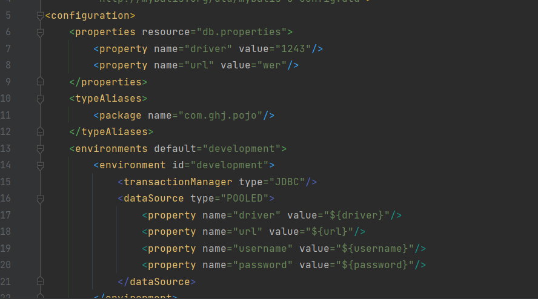
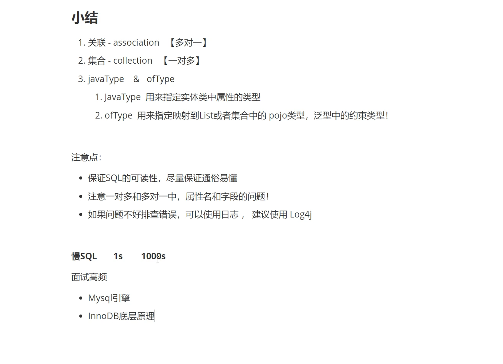
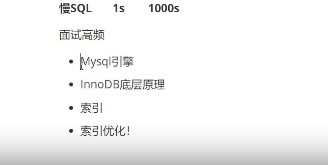

# Mybatis-study

## 静态资源绑定


```java
<build>
        <resources>
            <resource>
                <directory>src/main/resources</directory>
                <includes>
                    <include>**/*.properties</include>
                    <include>**/*.xml</include>
                </includes>
                <filtering>true</filtering>
            </resource>
            <resource>
                <directory>src/main/java</directory>
                <includes>
                    <include>**/*.properties</include>
                    <include>**/*.xml</include>
                </includes>
                <filtering>true</filtering>
            </resource>
        </resources>
    </build>
```

## 配置的顺序
```java
properties?,settings?,typeAliases?,typeHandlers?,objectFactory?,
objectWrapperFactory?,reflectorFactory?,plugins?,environments?,databaseIdProvider?,mappers?
```


## 接口的配置文件


```xml
<?xml version="1.0" encoding="UTF-8" ?>
<!DOCTYPE mapper
        PUBLIC "-//mybatis.org//DTD Mapper 3.0//EN"
        "http://mybatis.org/dtd/mybatis-3-mapper.dtd">
<mapper namespace="">
    
</mapper>

```


## 创造SqlSessionFactory

```java
public class MybatisUtils {
    private static SqlSessionFactory sqlSessionFactory;
    static{
        try {
            String resource = "mybatis-config.xml";
            InputStream inputStream = Resources.getResourceAsStream(resource);
            sqlSessionFactory = new SqlSessionFactoryBuilder().build(inputStream);
        } catch (IOException e) {
            e.printStackTrace();
        }
    }
    public static SqlSession getSqlSession(){
        return sqlSessionFactory.openSession();
    }
}

```


创建SqlSessionFactory工厂 ， 解析 mybatis-config.xml 文件中的配置， 创建相应的sqlSession；


## 通过properties资源文件来配置一些属性




### db.properties里的配置如下

```java
driver= com.mysql.cj.jdbc.Driver
url=jdbc:mysql://localhost:3306/malajava?useSSL=true&useUnicode=true&characterEncoding=UTF-8
username=root
password=123456
```


## 通过resource或class或package来注册xml文件

```java
<mappers>
        <mapper resource="com/ghj/dao/UserMapper.xml"/>
<!--        <mapper class="com.ghj.dao.UserMapper"/>
<!--        <package name="com.ghj.dao"/>-->
    </mappers>
```


## log4j的配置文件

- 先导入依赖
```java
<dependency>
    <groupId>log4j</groupId>
    <artifactId>log4j</artifactId>
    <version>1.2.17</version>
  </dependency>

```


- 在resources包下创建log4j.properties文件，文件配置如下：

```java
#将等级为DEBUG的日志信息输出到console和file这两个目的地，console和file的定义在下面的代码
log4j.rootLogger=DEBUG,console,file
#控制台输出的相关设置
log4j.appender.console = org.apache.log4j.ConsoleAppender
log4j.appender.console.Target = System.out
log4j.appender.console.Threshold=DEBUG
log4j.appender.console.layout = org.apache.log4j.PatternLayout
log4j.appender.console.layout.ConversionPattern=[%c]-%m%n
#文件输出的相关设置
log4j.appender.file = org.apache.log4j.RollingFileAppender
log4j.appender.file.File=./log/ghj.log
log4j.appender.file.MaxFileSize=10mb
log4j.appender.file.Threshold=DEBUG
log4j.appender.file.layout=org.apache.log4j.PatternLayout
log4j.appender.file.layout.ConversionPattern=[%p][%d{yy-MM-dd}][%c]%m%n
#日志输出级别
log4j.logger.org.mybatis=DEBUG
log4j.logger.java.sql=DEBUG
log4j.logger.java.sql.Statement=DEBUG
log4j.logger.java.sql.ResultSet=DEBUG
log4j.logger.java.sql.PreparedStatement=DEBUG
```

## 数据库分页显示

```text
select * from   表名  limit  starIndex， pageSize；

如果有6个用户 select  * from User limit 2，3；

则输出下标为2，3，4，的用户


将数据库分页显示，页大小为pageSize，从starIndex开始输出

select * from User limit 6;

表示页大小pageSize=6，starIndex = 0；
```


## 使用注解实现接口的方法

- 实现接口

```java
public interface UserMapper {


    @Select("select * from user")
    List<User> selectAll();

    @Select("select * from user where id = #{id}")
    User selectId(@Param("id") String id);

    @Insert("insert into user (id, name, age) values(#{id},#{name},#{time})")
    void addUser(User user);

    @Update("update  user set name = #{name}, age = #{time} where id = #{id}")
    void updateUser(User user);

    @Delete("delete from user where id = #{id}")
    void deleteUser(@Param("id") String id);
}
```

- 实现getter、setter、构造、重写toString、hashcode、 equals方法，  给类重命名

  ```java
  @Alias("ShaBi")
  
  @Data
  @AllArgsConstructor
  @NoArgsConstructor
  public class User {
      private String id;
      private String name;
      private int time;
  }
  ```

  

##  一对多查询（关联）

- 按照结果嵌套处理

```java
<resultMap id="StudentTeacher2" type="student">
        <result property="id" column="sid"/>
        <result property="name" column="sname"/>
        <association property="teacher" javaType="teacher">
            <result property="name" column="tname"/>
        </association>
    </resultMap>
    <select id="selectStudent2" resultMap="StudentTeacher2">
        select s.id sid,s.name sname,t.name tname from student s, teacher t where t.id = s.tid;
    </select>
```


- 按照查询嵌套处理

  ```java
  <resultMap id="StudentTeacher" type="student">
          <result property="id" column="id"/>
          <result property="name" column="name"/>
          <association property="teacher" column="tid" javaType="teacher" select="selectTeacher"/>
      </resultMap>
      <select id="selectStudent" resultMap="StudentTeacher">
          select * from student
      </select>
  
      <select id="selectTeacher" resultType="teacher">
          select * from teacher where id = #{tid}
      </select>
  ```


## 多对一查询 （集合）

- 按照结果嵌套处理

   ```java
   <resultMap id="StudentTeacher" type="teacher">
           <result property="id" column="tid"/>
           <result property="name" column="tname"/>
           <collection property="students" ofType="student">
               <result property="id" column="sid"/>
               <result property="name" column="sname"/>
               <result property="tid" column="tid"/>
           </collection>
       </resultMap>
       <select id="getTeacher" parameterType="_int" resultMap="StudentTeacher">
           select t.id tid, t.name tname,s.id sid, s.name sname
           from teacher t,student s
           where s.tid = tid and tid = #{id}
       </select>
   ```

- 按照查询嵌套处理

```java
<resultMap id="StudentTeacher2" type="teacher">
        <result property="id" column="id"/>
<!--        <result property="name" column="name"/>-->
        <collection property="students" javaType="ArrayList" ofType="student" column="id" select="getStudent">
<!--            <result property="id" column="id"/>-->
<!--            <result property="name" column="name"/>-->
        </collection>
    </resultMap>
    <select id="getTeacher2" parameterType="int" resultMap="StudentTeacher2">
        select * from teacher where id = #{id}
    </select>

    <select id="getStudent" parameterType="int" resultType="student">
        select s.id, s.name from student s where s.tid = #{id}
    </select>
```


### 注意点




!


## 动态SQL


- sql标签可以写一个sql语句，后面使用直接写标签include 引用id，可以减少重复代码的编写

```xml
<sql id="if-author-views">
        <if test="author != null">
            author = #{author}
        </if>
        <if test="views != null">
            and views = #{views}
        </if>
    </sql>
<select id="selectBlogIf" parameterType="blog" resultType="blog">
        select * from malajava.blog
        <where>
            <include refid="if-author-views"></include>
        </where>
    </select>
```

- if标签：如果满足test里的条件则执行里面的语句

- where标签可以智能的省去一些and 并且加上where语句，如果后面都没有语句则会省去where

  ```xml
  <select id="selectBlogChoose" parameterType="map" resultType="blog">
          select * from malajava.blog
          <where>
              <choose>
                  <when test="author != null">
                      author = #{author}
                  </when>
                  <when test="title != null">
                      title = #{title}
                  </when>
                  <otherwise>
                      views = #{views}
                  </otherwise>
              </choose>
          </where>
      </select>
  
  ```

- choose标签与我很标签可以选择其中一个语句执行，可以搭配where标签来使用

```xml
<update id="updateBlog" parameterType="map">
        update malajava.blog
        <set>
            <if test="author != null ">
                author = #{author},
            </if>
            <if test="views != null">
                views = #{views},
            </if>
            <if test="title != null">
                title = #{title},
            </if>
        </set>
        where id = #{id}
    </update>
```

- set标签一般与if标签一起使用，在执行update语句时使用。

  ```xml
  select id="selectBlogForeach" parameterType="map" resultType="blog">
          select * from blog
          <where>
              <foreach collection="ids" item="id"  separator="or">
                  id = #{id}
              </foreach>
          </where>
      </select>
  
  ```

- foreach标签一般是对集合使用，可以遍历集合里的所有元素，可以设置open属性来表示开始遍历之前应该写入什么；close属性表示

  结束遍历之后应该写什么； collection="ids" 写入需要遍历的集合的名字； item="id"后面循环语句里面集合里的元素的名称；  

  separator="or"每个循环之间的间隔应该写入什么；中间就是写入循环的语句。foreach一般也是与where一起使用。


## 缓存


```java
@Test
    public void test05(){
        SqlSession sqlSession = MybatisUtils.getSqlSession();
        BlogMapper mapper = sqlSession.getMapper(BlogMapper.class);

        HashMap map = new HashMap<>();
        ArrayList<Integer> ids = new ArrayList<>();
        ids.add(1);
        ids.add(2);
        map.put("ids",ids);

        List<Blog> blogs = mapper.selectBlogForeach(map);

        for (Blog blog : blogs) {
            System.out.println(blog);
        }

        /**
         * 一级缓存 , 默认开启一级缓存，只在一次sqlSession中有效，从开始到close
         * 执行第二相同的select操作时，不用再从数据库中查找，直接从缓存中
         * 并且blogs2 == blogs 地址内存都一样；
         * 当执行update、insert、delete语句时刷新缓存；
         * 默认采用LRU算法缓存；
         * 可以手动清空缓存；
         */
        System.out.println("-----------------------------------");
        List<Blog> blogs2 = mapper.selectBlogForeach(map);

        for (Blog blog : blogs2) {
            System.out.println(blog);
        }
        System.out.println(blogs == blogs2);
        sqlSession.close();

        /**
         * 开启二级缓存，可以缓存sqlSession关闭之前的内容；
         * 下次指定时间内开启会话查询相同的内容时则从缓存中查找；
         * 二级缓存只在一个namespace中有效，即在一个xml中有效；
         * 如果只写一个cache标签不带参数则要考虑序列化类；
         */
        System.out.println("-----------------------------------");
        SqlSession sqlSession1 = MybatisUtils.getSqlSession();
        BlogMapper mapper1 = sqlSession1.getMapper(BlogMapper.class);
        List<Blog> blogs1 = mapper1.selectBlogForeach(map);

        for (Blog blog : blogs1) {
            System.out.println(blog);
        }
        sqlSession1.close();
    }
```

```xml
<cache
  eviction="FIFO"
  flushInterval="60000"
  size="512"
  readOnly="true"/>
```

二级缓存的参数eviction设置缓存的算法默认是LRU算法；flushInterval设置刷新的时间；size设置缓存最大容量，超过容量则采用设置的

算法来清除一些缓存；readOnly设置是否只是可读。


缓存的原理图。
