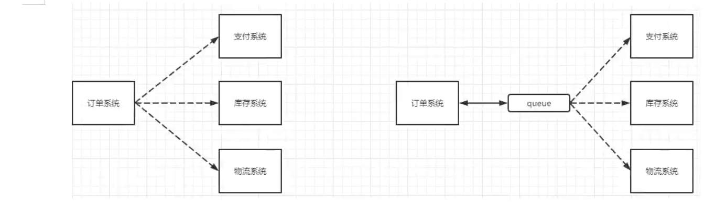

# RabbitMQ-study


## 介绍

功能介绍

- 流量消峰

当用户访问时候， 就会进入一个消息队列， 从而避免当访问人数过多时候服务器宕机， 但是与此同时的缺点就是，当访问的人多的时候， 那么就会变卡， 因为都在队列里面排着队， 会给用户带来不好的体验。

- 应用解耦



订单系统的完成需要支付系统、库存系统、物流系统三个系统的支持。

正常情况下： 如果说其中一个系统出故障， 那么就会导致订单系统不能正常执行。

使用MQ后 ：订单系统接收到订单后只须把请求给队列， 至此订单系统就完成了任务， 再由队列给请求到对应的系统， 如果其中一个系统故障， 那么队列会一直监督他，直到正常执行后。


- 异步处理

当A需要调用B时候， B处理需要一段时间， 此时A需要知道B是否执行完，以及执行完的信息， 就需要A提供一个接口， B执行完之后就调用该接口通知A， 或者A每隔一段时间就去查询B的结果， B也需要提供一个查询接口， 这样就很不优雅。 我们使用了MQ之后， A调用完B就直接执行后面的流程， 等B执行完， 就把结果放入MQ， MQ再把结果给到A。


> 四大核心概念

- 生产者
- 交换机
- 队列
- 消费者


## 安装

下载erlang语言环境， 然后下载安装socat， 最后安装rabbitmq，推荐使用docker。


- docker命令， 下载`rabbitmq:management`， 镜像

```bash
docker run -d --name rabbitmq -p 15672:15672 -p 5672:5672 -e RABBITMQ_DEFAULT_USER=admin -e RABBITMQ_DEFAULT_PASS=admin 镜像ID
```


- 开启前要配置hosts文件 ：`vim /etc/hosts` ，加上主机ip，以及hostname，hostname可以用命令`hostname`查询例如

  ```bash
  43.142.32.254 ghj-study
  ```

  并且开放对应的端口 ：

  ```bash
  4369   5672   5671   15672   15671   61613   61614   1883   8883
  ```

  

- 启动完成之后进入后台管理页面， 就会有一个登录页面


## java开发


> 依赖

```java
    <dependencies>
        <dependency>
            <groupId>com.rabbitmq</groupId>
            <artifactId>amqp-client</artifactId>
            <version>5.16.0</version>
        </dependency>
        <dependency>
            <groupId>commons-io</groupId>
            <artifactId>commons-io</artifactId>
            <version>2.11.0</version>
        </dependency>
    </dependencies>
```


> 生产者代码

```java
import com.rabbitmq.client.Channel;
import com.rabbitmq.client.Connection;
import com.rabbitmq.client.ConnectionFactory;

import java.nio.charset.StandardCharsets;


/**
 * @author 86187
 */
public class Producer {
    private static final String QUEUE_NAME = "hello";

    public static void main(String[] args) throws Exception{
        //创建连接工厂，设置参数
        ConnectionFactory factory = new ConnectionFactory();
        factory.setHost("43.142.32.254");
        factory.setUsername("admin");
        factory.setPassword("admin");

        //创建链接
        Connection connection = factory.newConnection();
        //创建信道
        Channel channel = connection.createChannel();

        /**
         * 生成一个队列
         * 1 队列名称
         * 2 队列的消息是否需要持久化 ， 默认消息存在内存， 非持久化
         * 3 该队列是否只供一个消费者 ，是否消息共享 ， true 多个消费者
         * 4 是否自动删除
         * 5 其他参数
         */
        channel.queueDeclare(QUEUE_NAME, false, false, false, null);

        String message = "hello rabbitmq";

        /**
         * 发送一个消费
         * 1 发送到哪个交换机
         * 2 路由的key是哪个  本次队列名称
         * 3 其他参数
         * 4 发送的消息体
         */

        channel.basicPublish("", QUEUE_NAME, null, message.getBytes(StandardCharsets.UTF_8));

        System.out.println("消息发送完成");
    }
}
```


运行之后，在之前的后台管理页面就可以看到有一个消息发送过来了


> 消费者


```java
import com.rabbitmq.client.*;


/**
 * @author 86187
 */
public class Consumer {

    private static final String QUEUE_NAME = "hello";

    public static void main(String[] args) throws Exception {
        //创建连接工厂，设置参数
        ConnectionFactory factory = new ConnectionFactory();
        factory.setHost("43.142.32.254");
        factory.setUsername("admin");
        factory.setPassword("admin");

        //创建链接
        Connection connection = factory.newConnection();
        //创建信道
        Channel channel = connection.createChannel();

        /**
         * 消费者消费消息
         * 1 队列的名称， 消费哪个队列
         * 2 消费成功之后是否需要自动答应， false代表手动 ， true代表自动
         * 3 消费者消费成功的回调函数
         * 4 消费者消费失败的回调函数
         */

        DeliverCallback deliverCallback = (consumerTag, message) -> {
            //message.getBody()获取的是消息体的字节数组
            System.out.println(new String(message.getBody()));
        };
        CancelCallback cancelCallback = (consumerTag) -> {
            System.out.println("消费者消费失败");
        };
        channel.basicConsume(QUEUE_NAME, true, deliverCallback, cancelCallback);
        
    }
}

```


运行完之后就会接收到生产者发送的消息


## WorkQueue


当有多个消费者时候， 队列里的消息会遵循轮询分配， 即一人一个， 并且一个消息只会被一个消费者处理一次。


- 首先提取出 获取 信道 channel 的方法

```java
import com.rabbitmq.client.Channel;
import com.rabbitmq.client.Connection;
import com.rabbitmq.client.ConnectionFactory;


/**
 * @author 86187
 * rabbitmq获取channel
 */
public class RabbitmqConnection {
    public static final String QUEUE_NAME = "hello";
    public static Channel getChannel() throws Exception{
        ConnectionFactory factory = new ConnectionFactory();
        factory.setHost("43.142.32.254");
        factory.setUsername("admin");
        factory.setPassword("admin");
        Connection connection = factory.newConnection();
        return connection.createChannel();
    }
}
```


- 然后写一个生产者， 使用 Scanner扫描控制台输入的信息从而 发出消息

```java
import com.ghj.util.RabbitmqConnection;
import com.rabbitmq.client.Channel;

import java.util.Scanner;

/**
 * @author 86187
 * 工作队列的生产者
 */
public class WorkProducer {
    public static void main(String[] args) throws Exception {
        Channel channel = RabbitmqConnection.getChannel();
        channel.queueDeclare(RabbitmqConnection.QUEUE_NAME, false, false, false, null);

        //持续扫描传入队列消息
        Scanner scanner = new Scanner(System.in);
        while (scanner.hasNext()){
            String message = scanner.next();
            channel.basicPublish("", RabbitmqConnection.QUEUE_NAME, null, message.getBytes());
        }
    }
}

```


- 最后写一个消费者类， 利用多线程开启多个消费者

```java
import com.ghj.util.RabbitmqConnection;
import com.rabbitmq.client.CancelCallback;
import com.rabbitmq.client.Channel;
import com.rabbitmq.client.DeliverCallback;

import java.util.concurrent.*;

/**
 * @author 86187
 */
public class WorkConsumers {
    public static void main(String[] args) {
        Consumers consumers1 = new Consumers();
        Consumers consumers2 = new Consumers();
        ThreadPoolExecutor threadPool = new ThreadPoolExecutor(2,
                5,
                3,
                TimeUnit.SECONDS,
                new ArrayBlockingQueue<>(5),
                Executors.defaultThreadFactory(),
                new ThreadPoolExecutor.AbortPolicy());
        threadPool.execute(consumers1);
        threadPool.execute(consumers2);
    }

    static class Consumers implements Runnable {
        @Override
        public void run() {
            try {
                Channel channel = RabbitmqConnection.getChannel();
                DeliverCallback deliverCallback = (consumerTag, message) -> {
                    System.out.println(Thread.currentThread().getName() + "收到消息：" + new String(message.getBody()));
                };
                CancelCallback cancelCallback = (consumerTag) -> {
                    System.out.println(Thread.currentThread().getName() + "接收消息失败!");
                };
                channel.basicConsume(RabbitmqConnection.QUEUE_NAME, true, deliverCallback, cancelCallback);
            } catch (Exception e) {
                e.printStackTrace();
            }
        }
    }
}

```


- 最后测试生产者持续发消息， 消费者都是轮询接收消息

```txt
生产者发出的消息:
aa
ss
dd
ff
gg
hh
jj

消费者接收的消息:
pool-3-thread-4收到消息：aa
pool-2-thread-4收到消息：ss
pool-3-thread-5收到消息：dd
pool-2-thread-5收到消息：ff
pool-3-thread-6收到消息：gg
pool-2-thread-6收到消息：hh
pool-3-thread-7收到消息：jj
```


这里的名字会不一样可能是因为在消息队列里面也是使用了多线程， 从而我们设置的名字没有输出，因为并不是我们这条线程去执行下面的run()方法里的东西，但是前缀是一样的。


## 消息应答


在消费者信道执行消费消息的方法上有一个参数是用来 选择是否自动应答， 应答就是当消息发送给消费者之后， 那么经过某些处理， 会应答给队列， 队列收到应答后就会把消息删除， 如果消费者没有应答， 消费者宕机了， 此时队列并没有收到应答， 就不会删除消息， 并且会发送给可以处理此消息的消费者。

> 消息丢失

 当消费者没有完成指定的任务， 就应答了， 并且此时消费者因为某种原因不能继续执行了， 队列依旧会产出消息， 那么就会出现消息的丢失， 我们必须避免这种情况。 使用自动应答，对于自动确认来说，当方法执行完毕后，会对MQ发出ACK；若该线程直接被关闭，会对MQ发出nack，消息会重回队列。


> 消息应答的方法

有三种应答方式， Channel.basicAck()确认应答，Channel.basicNack()否定应答， Channel.basicReject()否定应答，前两个方法有批量应答功能， 第二个参数改成true就代表批量应答， 会把当前消费者收到的未应答的消息都应答，但是尽量不适用批量应答。


> 测试

- 生产者

```java
import com.ghj.util.RabbitmqConnection;
import com.rabbitmq.client.Channel;

import java.nio.charset.StandardCharsets;
import java.util.Scanner;

/**
 * @author 86187
 */
public class ResProducer {
    private static final String QUEUE_NAME = "ack-queue";
    public static void main(String[] args) throws Exception {
        Channel channel = RabbitmqConnection.getChannel();
        channel.queueDeclare(QUEUE_NAME, false, false, false, null);

        Scanner scanner = new Scanner(System.in);
        System.out.println("生产者发送消息:");
        while (scanner.hasNext()){
            String next = scanner.next();
            channel.basicPublish("", QUEUE_NAME, null, next.getBytes(StandardCharsets.UTF_8));
        }
    }
}

```


- 消费者

```java
public class ResConsumers {

    public static void main(String[] args) {
        ThreadPoolExecutor executor = new ThreadPoolExecutor(2,
                3,
                5,
                TimeUnit.SECONDS,
                new ArrayBlockingQueue<>(3),
                Executors.defaultThreadFactory(),
                new ThreadPoolExecutor.AbortPolicy());

        ResConsumer consumer1 = new ResConsumer(1);
        ResConsumer consumer2 = new ResConsumer(30);

        executor.execute(consumer2);
        //executor.execute(consumer2);
    }
}

class ResConsumer implements Runnable {
    private static final String QUEUE_NAME = "ack-queue";
    private int sleepTime;
    public ResConsumer(int sleepTime){
        this.sleepTime = sleepTime;
    }
    @Override
    public void run() {
        try {
            Channel channel = RabbitmqConnection.getChannel();
            DeliverCallback deliverCallback = (consumerTag, message) -> {
                try {
                    Thread.currentThread().setName(sleepTime + "时间");
                    TimeUnit.SECONDS.sleep(sleepTime);
                    System.out.println(Thread.currentThread().getName() + "收到消息:" + new String(message.getBody()));
                    channel.basicAck(message.getEnvelope().getDeliveryTag(), false);
                } catch (InterruptedException e) {
                    e.printStackTrace();
                }
            };
            CancelCallback cancelCallback = (consumerTag) -> {
                System.out.println(Thread.currentThread().getName() + "接收失败回调");
            };
            channel.basicConsume(QUEUE_NAME, false, deliverCallback, cancelCallback);
        } catch (Exception e) {
            e.printStackTrace();
        }
    }
}

```


用消费者开启多个实例， idea开启多个实例支持， 然后第一个实例使用consumer1，第二个使用consumer2，这样就有一个时间差， 然后测试， 轮询分配消息， 等consumer2在sleep的时候关闭实例， 此时确认应答没有发出，消息会被分配到consumer1上面。


## 持久化


> 队列的持久化

- 队列的持久化只需要在生成队列的时候， 在持久化这个参数上改成true就好了，当rabbitmq重启了， 有被持久化的队列就会没掉， 被持久化的才会保存。


> 消息持久化

- 消息的持久化需要在生产者发送消息的时候写上对应的参数， 表示这个消息需要被持久化， 也就是存储在磁盘里面， 但是也不一定完全可以持久化， 当消息还在内存里， 正打算写入磁盘的时候， rabbitmq宕机了， 那么就丢失了，  消息持久化的前提是需要 队列持久化。
- 消息持久化参数

```java
channel.basicPublish("", QUEUE_NAME, MessageProperties.PERSISTENT_TEXT_PLAIN, next.getBytes(StandardCharsets.UTF_8));
```


> 不公平分发

- 之前消费者之间分发消息都是轮询分发， 在消费者性能不一样的情况下， 轮询会导致消息被处理的时间很长，应该遵循能者多劳的规则， 就是处理快的消费者多拿消息， 慢的少拿， 只需要设置消费者信道的参数就可以。

```java
//默认值是0，也就是轮询分配
channel.basicQos(1);
```


首先也是按照轮询分配， 当队列发送消息时， 该消费者还在处理之前的消息， 那么就会找到另一个空闲的消费者，将消息发送。


> 预取值

以上的设置不公平分发， 其实是设置该信道里允许有一个还未被处理的消息，也就是被阻塞的消息，当我们修改这个值， 那么就可以实现不同的分发效果， 之前设置的1， 也可以理解为只能有一个消息未被处理， 如果再发消息那么就会被分到别的消费者。

```java
channel.basicQos(prefetch);
```


## 发布确认


在之前的消息持久化的时候， 会有持久化失败的时候， 使用发布确认， 在消息发布之后， 等消息被保存， 便会通知生产者， 只要接到了确认，那么就代表持久化一定成功了

> 单个确认发布，批量确认发布， 异步确认发布

- 开启发布确认代码，在生成者的信道进行设置。

```java
channel.confirmSelect();
```


- 测试情况， 异步发布耗时远远更小， 并且可以知道哪一条发送成功， 哪一条失败， 有自己的成功失败回调接口

```java
import com.ghj.util.RabbitmqConnection;
import com.rabbitmq.client.Channel;
import com.rabbitmq.client.ConfirmCallback;

import java.nio.charset.StandardCharsets;
import java.util.UUID;

/**
 * @author 86187
 */
public class SendMessageTest {
    private static final int MESSAGE_COUNT = 1000;
    public static void main(String[] args) throws Exception {
        //测试单个确认
        //testSingle()
        //测试批量确认
        //testMany();
        testSyn();
    }

    /**
     * 测试单个确认发布1000条消息所需要的时间
     * @throws Exception
     * 耗时34992ms
     */
    private static void testSingle() throws Exception {
        Channel channel = RabbitmqConnection.getChannel();
        //开启发布确认
        channel.confirmSelect();
        String queueName = UUID.randomUUID().toString();
        channel.queueDeclare(queueName, true, false, false, null);
        long begin = System.currentTimeMillis();
        for (int i = 0; i < MESSAGE_COUNT; i++) {
            String message = i + "";
            channel.basicPublish("", queueName, null, message.getBytes(StandardCharsets.UTF_8));
            //等待确认
            channel.waitForConfirms();
        }
        long end = System.currentTimeMillis();
        System.out.println("消息全部发送完成， 耗时" + (end - begin) + "ms");
    }
    /**
     * 测试批量确认发布1000条消息耗时
     * 每100条确认一次
     * 耗时719ms
     */

    public static void testMany () throws Exception {
        Channel channel = RabbitmqConnection.getChannel();
        int ack = 100;
        //开启发布确认
        channel.confirmSelect();
        String queueName = UUID.randomUUID().toString();
        channel.queueDeclare(queueName, true, false, false, null);
        long begin = System.currentTimeMillis();
        for (int i = 0; i < MESSAGE_COUNT; i++) {
            String message = i + "";
            channel.basicPublish("", queueName, null, message.getBytes(StandardCharsets.UTF_8));
            //批量等待确认
            if(i % ack == 0){
                channel.confirmSelect();
            }
        }
        long end = System.currentTimeMillis();
        System.out.println("消息全部发送完成， 耗时" + (end - begin) + "ms");
    }
    /**
     * 测试异步确认发送1000条消息的耗时
     * 耗时69ms
     */
    private static void testSyn() throws Exception {
        Channel channel = RabbitmqConnection.getChannel();
        //开启发布确认
        channel.confirmSelect();
        String queueName = UUID.randomUUID().toString();
        channel.queueDeclare(queueName, true, false, false, null);
        long begin = System.currentTimeMillis();
        //成功消息的确认, 回调函数
        ConfirmCallback ackCallback = (deliveryTag, multiple) -> {
            System.out.println("成功确认的消息:" + deliveryTag);
        };

        //失败消息的确认, 回调函数
        ConfirmCallback nackCallback = (deliveryTag, multiple) -> {
            System.out.println("失败确认的消息:" + deliveryTag);
        };
        //开启异步确认  确认成功的消息  确认失败的消息
        channel.addConfirmListener(ackCallback,  nackCallback);

        for (int i = 0; i < MESSAGE_COUNT; i++) {
            String message = i + "";
            channel.basicPublish("", queueName, null, message.getBytes(StandardCharsets.UTF_8));
        }
        long end = System.currentTimeMillis();
        System.out.println("消息全部发送完成， 耗时" + (end - begin) + "ms");
    }
}

```


> 如何处理失败的回调

首先我们应该先找一种集合存储消息， 线程安全的集合， 并且可以通过序号删除， 支持高并发， 然后在发消息的时候放入消息， 成功回调的时候删除消息， 那么剩下的就是失败回调的消息，这样就可以进行处理了。


## 交换机

交换机的作用是一方面接收生产者发出的消息， 另一方面通过与自己绑定的队列， 以及绑定的Routing key，来选择把消息传送给队列

**一个队列绑定一个交换机，可以拥有多个routing key，队列获取的消息也就会更加多样性**


> 交换机的类型：

- 直接（direct）：之前使用的没有名字的交换机， 就是系统默认的一个 direct类型的交换机
- 主题（topic） ： 包含了direct和fanout类型， routingKey可以通过匹配模式来判断消息传到哪个队列
- 标题（headers）
- 扇出（fanout）：广播的方式，可以传给多个队列消息


- 声明交换机以及队列绑定交换机的代码

```java
//声明一个交换机， 类型是fanout类型
channel.exchangeDeclare(EXCHANGE_NAME, "fanout");

//队列绑定交换机， routing key是"22"
channel.queueBind(queueName, EXCHANGE_NAME, "22");
```


> 测试扇出（fanout）类型交换机

- 生产者

```java

public class ExcProducer {
    private static final String EXCHANGE_NAME = "lj-exchange";

    public static void main(String[] args) throws Exception {
        Channel channel = RabbitmqConnection.getChannel();
        //声明一个交换机， 类型是fanout类型
        channel.exchangeDeclare(EXCHANGE_NAME, "fanout");
        Scanner scanner = new Scanner(System.in);
        while (scanner.hasNext()){
            String message = scanner.next();
            channel.basicPublish(EXCHANGE_NAME, "22", null, message.getBytes(StandardCharsets.UTF_8));
        }
    }
}

```

- 消费者

```java
public class ExcConsumers {

    public static void main(String[] args) {
        ThreadPoolExecutor executor = new ThreadPoolExecutor(
                2,
                3,
                3,
                TimeUnit.SECONDS,
                new ArrayBlockingQueue<>(1),
                Executors.defaultThreadFactory(),
                new ThreadPoolExecutor.AbortPolicy()
        );
        ExcConsumer consumer1 = new ExcConsumer("ghj");
        ExcConsumer consumer2 = new ExcConsumer("lj");
        executor.execute(consumer1);
        executor.execute(consumer2);
    }
}
class ExcConsumer implements Runnable{
    private static final String EXCHANGE_NAME = "lj-exchange";
    private String name;
    public ExcConsumer(String name){
        this.name = name;
    }
    @Override
    public void run() {
        try {
            Channel channel = RabbitmqConnection.getChannel();
            //声明一个临时的队列， 当没有消费者链接就会删除此队列。
            String queueName = channel.queueDeclare().getQueue();
            //队列绑定交换机
            channel.queueBind(queueName, EXCHANGE_NAME, "22");

            DeliverCallback deliverCallback = (consumerTag, message) ->{
                System.out.println(name + "成功收到消息：" + new String(message.getBody()));
            };
            channel.basicConsume(queueName, true, deliverCallback, (consumerTag) -> {});
        } catch (Exception e) {
            e.printStackTrace();
        }
    }
}
```


测试后就会发现， 生成者发的消息在两个消费者里面都可以接收到， 即使队列的routing key和生产者消息的routing key不一致， 只要绑定了该交换机， 那么也会收到消息。


> 测试直接（direct）类型交换机

- 将之前的交换机的类型修改为 direct。
- 设置交换机生产者的发出的消息的routing key为 33
- 设置 第一个消费者的队列 routing key为 22， 第二个为 22， 33.
- 启动之后， 就只有第二个消费者可以收到消息。


> 测试主题（topic）交换机


- 主题交换机包含了之前两个的功能， 其中的routing key 是由一个单词组 的形式，每个单词之间只用` . `来分隔，里面可以用 `*` 来表示任何一个单词， 用 `#`来表示多个或者 0 个单词 ， 例如：

  ```txt
  *.kk.*  表示可以匹配是三个单词，并且中间的是kk的单词组
  
  la.#  表示可以匹配 以la单词开头的所有的单词组
  
  aa.bb.cc 则表示只能匹配 aa.bb.cc的单词， 这样使用就类似是 direct 类型交换机
  
  #    表示可以匹配所有的单词， 这样就类似与 是 fanout类型的交换机
  ```

  

- 生产者

```java
public class TopicProducer {
    private static final String EXCHANGE_NAME = "topic-exchange";

    public static void main(String[] args) throws Exception {
        Channel channel = RabbitmqConnection.getChannel();
        //声明一个交换机， 类型是topic类型
        channel.exchangeDeclare(EXCHANGE_NAME, BuiltinExchangeType.TOPIC);
        Scanner scanner = new Scanner(System.in);
        int i = 0;
        while (scanner.hasNext()){
            String message = scanner.next();
            String routingKey;
            switch (i % 3){
                case 0:
                    //第一个获取消息
                    routingKey = "ll.kk.ww";
                    break;
                case 1:
                    //第二个获取消息
                    routingKey = "la.ss";
                    break;
                case 2:
                    //1 2 都获取消息
                    routingKey = "la.kk.zz";
                    break;
                default:
                    routingKey = "";
            }
            i ++;
            channel.basicPublish(EXCHANGE_NAME, routingKey, null, message.getBytes(StandardCharsets.UTF_8));
        }
    }
}

```


- 消费者

```java
public class TopicConsumers {
    public static void main(String[] args) {
        ThreadPoolExecutor executor = new ThreadPoolExecutor(
                2,
                3,
                3,
                TimeUnit.SECONDS,
                new ArrayBlockingQueue<>(1),
                Executors.defaultThreadFactory(),
                new ThreadPoolExecutor.AbortPolicy()
        );

        TopicConsumer consumer1 = new TopicConsumer(new String[]{"*.kk.*"}, "ghj");
        TopicConsumer consumer2 = new TopicConsumer(new String[]{"la.#"}, "lj");

        executor.execute(consumer1);
        executor.execute(consumer2);

    }
}
class TopicConsumer implements Runnable{
    private static final String EXCHANGE_NAME = "topic-exchange";
    private final String[] routingKeys;
    private final String name;
    public TopicConsumer(String[] routingKeys, String name){
        this.routingKeys = routingKeys;
        this.name = name;
    }
    @Override
    public void run() {
        try {
            Channel channel = RabbitmqConnection.getChannel();
            String queueName = channel.queueDeclare().getQueue();
            for (String routingKey : routingKeys) {
                channel.queueBind(queueName, EXCHANGE_NAME, routingKey);
            }
            DeliverCallback deliverCallback = (consumerTag, message) ->{
                System.out.println(name + "收到消息：" + new String(message.getBody(), StandardCharsets.UTF_8));
                //输出 routingKey
                System.out.println(name + "routingKey是：" + message.getEnvelope().getRoutingKey());
            };
            channel.basicConsume(queueName, true, deliverCallback, consumerTag -> {});
        } catch (Exception e) {
            e.printStackTrace();
        }
    }
}

```


测试之后， 就会发现会根据routingKey的匹配模式来匹配对应的 队列。


## 死信队列

当消息在队列里面的时间超过TTL过期时间或者 消息被拒绝， 或者 队列达到了最大长度， 那么消息就会成为死信， 也就会进入到死信队列， 进入死信队列， 也需要先经过死信交换机， 然后通过routingKey进入到对应的死信队列， 与之对应的， 也会有死信的消费者。


- 正常消费者

```java
public class NormalConsumer {
    private static final String NORMAL_EXCHANGE = "normal-exc";
    private static final String DEAD_EXCHANGE = "dead-exc";
    private static final String NORMAL_QUEUE = "normal-queue";
    private static final String DEAD_QUEUE = "dead-queue";

    public static void main(String[] args) throws Exception {
        Channel channel = RabbitmqConnection.getChannel();
        //声明普通交换机
        channel.exchangeDeclare(NORMAL_EXCHANGE, BuiltinExchangeType.DIRECT);
        //声明死信交换机
        channel.exchangeDeclare(DEAD_EXCHANGE, BuiltinExchangeType.DIRECT);
        //声明普通队列
        Map<String, Object> arguments = new HashMap<>();
        //设置消息的ttl 一般是通过消息来设置消息的ttl， 而不是在队列统一设置ttl
        //arguments.put("x-message-ttl",10000);

        //绑定死信交换机
        arguments.put("x-dead-letter-exchange", DEAD_EXCHANGE);
        //设置该队列的死信routingKey
        arguments.put("x-dead-letter-routing-key","dead");
        channel.queueDeclare(NORMAL_QUEUE, false, false, false, arguments);
        //绑定正常的交换机
        channel.queueBind(NORMAL_QUEUE, NORMAL_EXCHANGE, "normal");
        //声明死信队列
        channel.queueDeclare(DEAD_QUEUE, false, false, false, null);
        //死信队列绑定死信交换机
        channel.queueBind(DEAD_QUEUE, DEAD_EXCHANGE, "dead");

        DeliverCallback deliverCallback = (consumerTag, message) -> {
            System.out.println("正常消费者收到消息:" + new String(message.getBody(), StandardCharsets.UTF_8));
        };
        channel.basicConsume(NORMAL_QUEUE, true, deliverCallback, consumerTag -> {});
    }
}

```


- 正常生产者

```java
public class DeadProducer {
    private static final String NORMAL_EXCHANGE = "normal-exc";
    public static void main(String[] args) throws Exception {
        Channel channel = RabbitmqConnection.getChannel();
        //设置消息的ttl
        AMQP.BasicProperties properties = new AMQP.BasicProperties()
                .builder()
                .expiration("10000")
                .build();
        for (int i = 0; i < 10; i++) {
            String message = "info" + i;
            channel.basicPublish(NORMAL_EXCHANGE, "normal", properties, message.getBytes(StandardCharsets.UTF_8));
        }
    }
}

```


- 死信消费者

```java
public class DeadConsumer {
    private static final String DEAD_QUEUE = "dead-queue";
    public static void main(String[] args) throws Exception {
        Channel channel = RabbitmqConnection.getChannel();
        DeliverCallback deliverCallback = (consumerTag, message) -> {
            System.out.println("死信消费者收到消息:" + new String(message.getBody(), StandardCharsets.UTF_8));
        };
        channel.basicConsume(DEAD_QUEUE, true, deliverCallback, consumerTag -> {});
    }
}

```


首先允许正常消费者， 创建好交换机以及队列， 然后关闭消费者， 打开生产者， 在正常队列就会有10条消息， 过了 ttl时间之后， 正常队列的消息就都会在死信队列里面。


> 设置队列最大长度

只需要在参数map上加一个参数：

```java
//设置队列最大长度
arguments.put("x-max-length", 6);
```


当队列里面的消息超过最大长度， 那么就会进入到死信队列。


> 拒绝接收消息

修改一下普通消费者的成功回调接口， 以及设置接收消息不自动确认

```java
DeliverCallback deliverCallback = (consumerTag, message) -> {
            String msg = new String(message.getBody(), StandardCharsets.UTF_8);
            if("info3".equals(msg)){
                //拒绝接收消息， 参数是消息的tag， 以及是否重新入队列
                channel.basicReject(message.getEnvelope().getDeliveryTag(), false);
            }else {
                System.out.println("正常消费者收到消息:" + msg);
                //确认
                channel.basicAck(message.getEnvelope().getDeliveryTag(), false);
            }
};
channel.basicConsume(NORMAL_QUEUE, false, deliverCallback, consumerTag -> {});
```


启动消费者与生产者之后就会发现， 只有一个消息是在死信队列。


## 延迟队列


延迟队列其实就是之前的死信队列中的 超过ttl时长 的死信队列。


使用SpringBoot整合rabbitmq， springBoot版本低一点 2.5.0

```xml
	<!--rabbitmq-->
        <dependency>
            <groupId>org.springframework.boot</groupId>
            <artifactId>spring-boot-starter-amqp</artifactId>
        </dependency>

        <dependency>
            <groupId>com.alibaba</groupId>
            <artifactId>fastjson</artifactId>
            <version>2.0.10</version>
        </dependency>


        <dependency>
            <groupId>io.springfox</groupId>
            <artifactId>springfox-swagger2</artifactId>
            <version>2.9.2</version>
        </dependency>

        <dependency>
            <groupId>io.springfox</groupId>
            <artifactId>springfox-swagger-ui</artifactId>
            <version>2.9.2</version>
        </dependency>

        <dependency>
            <groupId>org.springframework.amqp</groupId>
            <artifactId>spring-rabbit-test</artifactId>
            <scope>test</scope>
        </dependency>

        <dependency>
            <groupId>org.springframework.boot</groupId>
            <artifactId>spring-boot-starter</artifactId>
        </dependency>

        <dependency>
            <groupId>org.springframework.boot</groupId>
            <artifactId>spring-boot-starter-web</artifactId>
        </dependency>

```


- yml配置连接rabbitmq

```yaml
spring:
  rabbitmq:
    host: 43.142.32.254
    port: 5672
    username: admin
    password: admin
```


- 配置swagger

```java
@Configuration
@EnableSwagger2
public class SwaggerConfig {
    @Bean
    public Docket webApiConfig(){
        return new Docket(DocumentationType.SWAGGER_2)
                .groupName("webApi")
                .apiInfo(webApiInfo())
                .select()
                .build();
    }

    private ApiInfo webApiInfo(){
        return new ApiInfoBuilder()
                .title("rabbitmq接口文档")
                .description("文本描述")
                .version("1.0")
                .contact(new Contact("lj", "https://atljlj.com", "1342354@qq.com"))
                .build();
    }
}

```


- 配置队列， 交换机， 以及之间的绑定

```java
@Configuration
public class TtlQueueConfig {
    /**
     * 名称
     */
    private static final String QUEUE_A = "qa";
    private static final String QUEUE_B = "qb";
    private static final String DEAD_QUEUE_D = "qd";
    private static final String EXCHANGE_X = "ex";
    private static final String EXCHANGE_Y = "ey";

    /**
     *声明交换机
     */
    @Bean("xExchange")
    public DirectExchange xExchange(){
        return new DirectExchange(EXCHANGE_X);
    }
    @Bean("yExchange")
    public DirectExchange yExchange(){
        return new DirectExchange(EXCHANGE_Y);
    }

    /**
     * 声明队列
     */
    @Bean("queueA")
    public Queue queueA(){
        Map<String, Object> args = new HashMap<>(3);
        //设置死信交换机
        args.put("x-dead-letter-exchange", EXCHANGE_Y);
        //设置死信routingKey
        args.put("x-dead-letter-routing-key", "da");
        //设置ttl时间
        args.put("x-message-ttl", 10000);
        return QueueBuilder.nonDurable(QUEUE_A).withArguments(args).build();
    }

    @Bean("queueB")
    public Queue queueB(){
        Map<String, Object> args = new HashMap<>(3);
        //设置死信交换机
        args.put("x-dead-letter-exchange", EXCHANGE_Y);
        //设置死信routingKey
        args.put("x-dead-letter-routing-key", "da");
        //设置ttl时间
        args.put("x-message-ttl", 40000);
        return QueueBuilder.nonDurable(QUEUE_B).withArguments(args).build();
    }

    @Bean("queueD")
    public Queue queueD(){
        return QueueBuilder.nonDurable(DEAD_QUEUE_D).build();
    }

    /**
     * 绑定
     */
    @Bean
    public Binding queueABindX(@Qualifier("queueA") Queue queueA, @Qualifier("xExchange") DirectExchange exchangeX){
        return BindingBuilder.bind(queueA).to(exchangeX).with("xa");
    }
    @Bean
    public Binding queueBBindX(@Qualifier("queueB") Queue queueB, @Qualifier("xExchange") DirectExchange exchangeX){
        return BindingBuilder.bind(queueB).to(exchangeX).with("xb");
    }
    @Bean
    public Binding queueDBindY(@Qualifier("queueD") Queue queueD, @Qualifier("yExchange") DirectExchange exchangeY){
        //这里的routingKey就是 qa，qb网死信交换机发消息的routingKey
        return BindingBuilder.bind(queueD).to(exchangeY).with("da");
    }
}

```


- 配置controller为生产者

```java
@Slf4j
@RestController
@RequestMapping("/ttl")
public class SendMsgController {

    @Autowired
    private RabbitTemplate rabbitTemplate;

    @GetMapping("/send/{message}")
    public void send(@PathVariable String message){
        log.info("当前时间：{}，发送消息：{}", new Date(), message);
        //发送消息
        rabbitTemplate.convertAndSend("ex", "xa", "来自10s队列" + message);
        rabbitTemplate.convertAndSend("ex", "xb", "来自40s队列" + message);
    }
}

```


- 配置死信队列消费者

```java
@Slf4j
@Component
public class DeadQueueConsumer {

    @RabbitListener(queues = "qd")
    public void receiveD(Message message, Channel channel){
        String msg = new String(message.getBody(), StandardCharsets.UTF_8);
        log.info("当前时间：{}， 收到死信队列消息：{}", new Date(), msg);
    }
}

```


开启之后访问 controller， 就会通过交换机发消息给 qa和qb， 但是经过了ttl时间没有消费， 就会到死信交换机对应的死信队列， 从而被死信消费者消费。

```txt
2022-10-04 20:44:19.179  INFO 19588 --- [nio-8080-exec-1] c.g.r.controller.SendMsgController       : 当前时间：Tue Oct 04 20:44:19 CST 2022，发送消息：嘻嘻嘻
2022-10-04 20:44:29.362  INFO 19588 --- [ntContainer#0-1] c.g.r.consumers.DeadQueueConsumer        : 当前时间：Tue Oct 04 20:44:29 CST 2022， 收到死信队列消息：来自10s队列嘻嘻嘻
2022-10-04 20:44:59.262  INFO 19588 --- [ntContainer#0-1] c.g.r.consumers.DeadQueueConsumer        : 当前时间：Tue Oct 04 20:44:59 CST 2022， 收到死信队列消息：来自40s队列嘻嘻嘻
```


> 优化延迟队列

之前的延迟队列， 是在普通队列设置了ttl时间， 如果另一个消息过期时间不一样就要再建一个队列， 就很麻烦， 因此，可以参照之前的死信队列， 在生产者发消息的时候设置ttl。


首先新增一个队列， 不需要设置ttl， 然后写生产者， 发消息的时候设置ttl

```java
@GetMapping("/sendMsg/{message}/{ttl}")
    public void sendMsg(@PathVariable String message, @PathVariable String ttl){
        log.info("当前时间：{}，发送消息：{}， ttl时间为：{}", new Date(), message, ttl);

        rabbitTemplate.convertAndSend("ex","xc","来自优化队列" + message, msg -> {
            //设置ttl时间
            msg.getMessageProperties().setExpiration(ttl);
            return msg;
        });
    }
```


通过测试发现，可以实现自动设置ttl， 但是，如果连续发两个消息，第一个设置20秒， 第二个设置2秒， 这样第二个消息还是会等到第一个消息消费完之后才会消费第二个消息，也就是第一个信息还在队列里面， 还没有被队列删除， 需要等待删除第一个才会给消费者第二个消费。


> 基于插件实现延迟队列


- 下载安装插件参看：https://www.jb51.net/article/248469.htm，安装重启完成后， 在rabbitmq的web页面新建交换机的类型有一个`x-delayed-message`类型。


- 基于插件的延迟队列不需要两个交换机， 在第一个交换机里面消息延迟发送给队列， 队列进而给消费者。

.jpg)


- 基于插件的配置

```java
@Configuration
public class DelayedQueueConfig {

    private static final String EXCHANGE_NAME = "delay.exchange";
    private static final String QUEUE_NAME = "delay.queue";
    private static final String ROUTING_KEY = "delay.routingKey";

    /**
     * 队列
     * @return
     */
    @Bean
    public Queue delayQueue(){
        return new Queue(QUEUE_NAME);
    }

    /**
     * 交换机设置
     * @return
     */
    @Bean
    public CustomExchange delayExchange(){
        Map<String, Object> arguments = new HashMap<>();
        //设置交换机类型
        arguments.put("x-delayed-type", "direct");
        return new CustomExchange(EXCHANGE_NAME,"x-delayed-message",  false, false, arguments);
    }

    /**
     * 绑定
     * @param delayQueue
     * @param delayExchange
     * @return
     */
    @Bean
    public Binding queueBindDelayExchange(@Qualifier("delayQueue") Queue delayQueue, @Qualifier("delayExchange") CustomExchange delayExchange){
        return BindingBuilder.bind(delayQueue).to(delayExchange).with(ROUTING_KEY).noargs();
    }
}

```


- 生产者发送延迟时间

```java
    @GetMapping("/sendDelayMsg/{message}/{delayTime}")
    public void sendDelayMsg(@PathVariable String message, @PathVariable Integer delayTime){
        log.info("当前时间：{}，发送消息：{}， ttl时间为：{}", new Date(), message, delayTime);

        rabbitTemplate.convertAndSend("delay.exchange","delay.routingKey","来自插件优化队列" + message, msg -> {
            //设置ttl时间
            msg.getMessageProperties().setDelay(delayTime);
            return msg;
        });
    }
```


- 消费者不需要做任何改动


运行测试之后之前的优化队列存在的问题， 就可以被解决， 就算第一个消息延迟20秒，第二个延迟2秒， 第二个可以比第一个更先接收

```txt
2022-10-05 18:32:41.482  INFO 25636 --- [nio-8080-exec-4] c.g.r.controller.SendMsgController       : 当前时间：Wed Oct 05 18:32:41 CST 2022，发送消息：ghj， ttl时间为：20000
2022-10-05 18:32:46.950  INFO 25636 --- [nio-8080-exec-8] c.g.r.controller.SendMsgController       : 当前时间：Wed Oct 05 18:32:46 CST 2022，发送消息：lj， ttl时间为：2000
2022-10-05 18:32:49.073  INFO 25636 --- [ntContainer#1-1] c.g.r.consumers.DeadQueueConsumer        : 当前时间：Wed Oct 05 18:32:49 CST 2022， 收到延迟队列消息：来自插件优化队列lj
2022-10-05 18:33:01.518  INFO 25636 --- [ntContainer#1-1] c.g.r.consumers.DeadQueueConsumer        : 当前时间：Wed Oct 05 18:33:01 CST 2022， 收到延迟队列消息：来自插件优化队列ghj
```


## 高级发布确认


当生产者发送完消息后， rabbitmq宕机了， 其中的交换机或者是队列不能收到消息， 那么消息就可能会丢失， 此时， 生产者不知道消息是否被交换机，队列收到， 则需要通知生产者， 并且把丢失的消息缓存起来，待到交换机可以接收消息再发出去。


- 配置交换机，队列，绑定

```java
@Configuration
public class ConfirmConfig {
    public static final String QUEUE = "confirm.queue";
    public static final String EXCHANGE = "confirm.exchange";
    public static final String ROUTING_KEY = "kkk";

    @Bean("confirmQueue")
    public Queue confirmQueue(){
        return new Queue(QUEUE);
    }

    @Bean("confirmExchange")
    public DirectExchange confirmExchange(){
        return new  DirectExchange(EXCHANGE);
    }

    @Bean
    public Binding confirmQueueBindEx(@Qualifier("confirmQueue") Queue queue, @Qualifier("confirmExchange") DirectExchange exchange){
        return BindingBuilder.bind(queue).to(exchange).with(ROUTING_KEY);
    }
}

```


- 生产者

```java
@Slf4j
@RestController
@RequestMapping("/con")
public class ConfirmController {

    @Autowired
    RabbitTemplate rabbitTemplate;

    @GetMapping("/send/{message}")
    public void confirmSend(@PathVariable String message){
        log.info("当前时间：{}，高级确认发出消息：{}", new Date(), message);
        //设置 correlationData， 在回调接口可以使用到
        CorrelationData correlationData = new CorrelationData("1");
        Message msg = new Message(message.getBytes(StandardCharsets.UTF_8));
        ReturnedMessage returnedMessage = new ReturnedMessage(msg, 2, "xxx", ConfirmConfig.EXCHANGE, ConfirmConfig.ROUTING_KEY);
        correlationData.setReturned(returnedMessage);
        rabbitTemplate.convertAndSend(ConfirmConfig.EXCHANGE, ConfirmConfig.ROUTING_KEY, message, correlationData);
        rabbitTemplate.convertAndSend(ConfirmConfig.EXCHANGE, ConfirmConfig.ROUTING_KEY + "11", message + "11", correlationData);
    }
}

```


- 消费者

```java
@Slf4j
@Component
public class ConfirmConsumer {

    @RabbitListener(queues = ConfirmConfig.QUEUE)
    public void receiveConfirm(Message message, Channel channel){
        String msg = new String(message.getBody(), StandardCharsets.UTF_8);
        log.info("当前时间：{}， 收到高级确认队列消息：{}", new Date(), msg);
    }
}

```


- yaml配置文件

```yaml
spring:
  rabbitmq:
    # 声明发布确认的类型
    publisher-confirm-type: correlated
    # 开启消息回退
    publisher-returns: true
```


- 配置类

```java
import lombok.extern.slf4j.Slf4j;
import org.springframework.amqp.core.ReturnedMessage;
import org.springframework.amqp.rabbit.connection.CorrelationData;
import org.springframework.amqp.rabbit.core.RabbitTemplate;
import org.springframework.beans.factory.annotation.Autowired;
import org.springframework.stereotype.Component;

import javax.annotation.PostConstruct;
import java.nio.charset.StandardCharsets;
import java.util.Date;

/**
 * @author 86187
 * 定义自己的 交换机确认接收消息后的回调
 */
@Slf4j
@Component
public class MyCallBack implements RabbitTemplate.ConfirmCallback, RabbitTemplate.ReturnsCallback{

    @Autowired
    RabbitTemplate rabbitTemplate;

    /**
     * 初始化， 将rabbitTemplate类里的 confirmCallback 替换为我们自己写的
     * 该注解 会让这个方法在bean组策完成之后执行这个方法
     */
    @PostConstruct
    public void init(){
        rabbitTemplate.setConfirmCallback(this);
        rabbitTemplate.setReturnsCallback(this);
    }
    /**
     *
     * @param correlationData  消息的id以及内容， 并不是每个消息都有， 需要在发消息的时候配置
     * @param ack  交换机是否成功收到消息
     * @param cause  失败的原因
     */
    @Override
    public void confirm(CorrelationData correlationData, boolean ack, String cause) {
        String id = null;
        String msg = null;
        if(correlationData != null){
            id = correlationData.getId();
            byte[] body = correlationData.getReturned().getMessage().getBody();
            msg = new String(body, StandardCharsets.UTF_8);
        }
        if(ack){
            log.info("交换机收到消息id为：{}, 消息是：{}, 当前时间为：{}", id, msg, new Date());
        }else {
            log.info("交换机没有收到消息id为：{}, 消息是：{}, 当前时间为：{}", id, msg, new Date());
            log.info("失败的原因是：{}", cause);
        }
    }

    /**
     * 当消息没有成功发送到队列时候， 会触发这个方法
     * @param returned 消息的一些信息，这里的ReturnedMessage与交换机未接受的ReturnedMessage不一样， 内容不是一样的
     */
    @Override
    public void returnedMessage(ReturnedMessage returned) {
        log.info("消息：{}，没有被队列接收， 交换机是：{}， 路由key是：{}， 原因是：{}， code：{}",
                new String(returned.getMessage().getBody(), StandardCharsets.UTF_8), returned.getExchange(), returned.getRoutingKey(),
                returned.getReplyText(), returned.getReplyCode());
    }
}

```


当发送的消息没有被交换机接收， 就会回调confirm()方法， 获取到没接收的消息， 当消息没有被队列接收那么就会回退，会调用returnedMessage()回调，获取发送的消息


## 备份交换机


给交换机配置备份交换机

```java
//绑定备份交换机
return ExchangeBuilder.directExchange(EXCHANGE).alternate(BACK_EXCHANGE).build();

```


当交换机收到消息，但是找不到routingKey对应的队列， 就会从该交换机转发到备份交换机， 备份交换机通常是fanout类型， 然后转发到队列， 被消费。如果消息直接不被交换机收到， 那么也不会被备份交换机收到。


当同时开启消息回退， 以及备份交换机， 也就是交换机收到消息， routingKey对应的队列找不到， 那么消息会进入到备份机里面， 而不会进入到消息回退的方法里面。


## 优先级队列


给消息设置优先级， 权重大的优先被发送， 类似redis的zset，这个需要有消息堆积的时候才会体现， 如果发出来的消息都直接被消费了， 那么就体现不出来。


- 测试生产者

```java
/**
 * @author 86187
 * 测试优先级队列
 */
public class PriProducer {
    public static void main(String[] args) throws Exception {
        Channel channel = RabbitmqConnection.getChannel();
        Map<String, Object> props = new HashMap<>();
        //设置队列优先级
        props.put("x-max-priority", 10);
        channel.queueDeclare("priority", false, false, false, props);
        channel.exchangeDeclare("priority-exc", BuiltinExchangeType.DIRECT);

        channel.queueBind("priority", "priority-exc", "priority");
        for (int i = 0; i < 10; i++) {
            String msg = "info" + i;
            if(i == 6){
                //设置消息的优先级
                AMQP.BasicProperties properties = new AMQP.BasicProperties().builder().priority(10).build();
                channel.basicPublish("priority-exc", "priority", properties, msg.getBytes(StandardCharsets.UTF_8));
            }
            else {
                channel.basicPublish("priority-exc", "priority", null, msg.getBytes(StandardCharsets.UTF_8));
            }
        }
    }
}
```


- 消费者

```java
/**
 * @author 86187
 * 测试优先级队列  消费者
 * info 6 会被优先接收
 */
public class PriConsumer {
    public static void main(String[] args) throws Exception {
        Channel channel = RabbitmqConnection.getChannel();
        DeliverCallback deliverCallback = (consumerTag, message) -> {
            System.out.println("消息已被接收：" + new String(message.getBody(), StandardCharsets.UTF_8));
        };
        channel.basicConsume("priority", true, deliverCallback, consumerTag -> {});
    }
}

```


## 惰性队列


当消费者宕机， 导致消息堆积在队列， 因为消息是存放在内存中，因此会很占用内存， 使用惰性队列， 就会把消息存放在磁盘里面， 有点类似队列的持久化， 但是持久化是在内存以及磁盘上都保持一份消息， 并且是在内存中读取， 惰性队列则是只存放在磁盘中， 在内存中仅仅是放消息的索引。


设置惰性队列，只需要在参数上加上一个 参数 `x-queue-mode`为`lazy`就可以。
