# SpringCloud-Study


## 与SpringBoot的关系 

- SpringBoot是用来构建微服务的， SpringCloud是用来协调微服务的。SpringBoot把程序打成一个个的jar包在SpringCloud上运行。
- SpringCloud是关注于全局的微服务协调整理治理框架， 把SpringBoot的一个个单体服务整合到一起管理， 为各个服务之间提供： 配置管理， 服务发现， 断路器， 路由， 微代理， 事件总线， 全局锁， 决策竞选， 分布式会话等等集成服务。
- SpringBoot可以离开SpringCloud独立使用，但是SpringCloud离不开SpringBoot。
- SpringBoot关注各个单体开发 ， SpringCloud专注于全局的服务治理框架。


## Rest学习环境搭建


- 建立父工程导包

```xml
<?xml version="1.0" encoding="UTF-8"?>
<project xmlns="http://maven.apache.org/POM/4.0.0"
         xmlns:xsi="http://www.w3.org/2001/XMLSchema-instance"
         xsi:schemaLocation="http://maven.apache.org/POM/4.0.0 http://maven.apache.org/xsd/maven-4.0.0.xsd">
    <modelVersion>4.0.0</modelVersion>

    <groupId>org.example</groupId>
    <artifactId>springCloud-study</artifactId>
    <version>1.0-SNAPSHOT</version>
    <modules>
        <module>springcloud-api</module>
        <module>sptingcloud-provider-dept-8001</module>
    </modules>

    <packaging>pom</packaging>
    <properties>
        <maven.compiler.source>17</maven.compiler.source>
        <maven.compiler.target>17</maven.compiler.target>
        <junit.version>4.13.2</junit.version>
        <log4j.version>1.2.17</log4j.version>
        <lombok.version>1.18.24</lombok.version>
    </properties>

    <dependencyManagement>
        <dependencies>
            <dependency>
                <groupId>org.springframework.cloud</groupId>
                <artifactId>spring-cloud-dependencies</artifactId>
                <version>2021.0.2</version>
                <type>pom</type>
                <scope>import</scope>
            </dependency>

            <dependency>
                <groupId>org.springframework.boot</groupId>
                <artifactId>spring-boot-dependencies</artifactId>
                <version>2.6.7</version>
                <type>pom</type>
                <scope>import</scope>
            </dependency>

            <dependency>
                <groupId>mysql</groupId>
                <artifactId>mysql-connector-java</artifactId>
                <version>8.0.29</version>
            </dependency>

            <dependency>
                <groupId>com.alibaba</groupId>
                <artifactId>druid</artifactId>
                <version>1.2.9</version>
            </dependency>

            <dependency>
                <groupId>org.mybatis.spring.boot</groupId>
                <artifactId>mybatis-spring-boot-starter</artifactId>
                <version>2.2.2</version>
            </dependency>

            <dependency>
                <groupId>ch.qos.logback</groupId>
                <artifactId>logback-core</artifactId>
                <version>1.3.0-alpha14</version>
            </dependency>


            <dependency>
                <groupId>junit</groupId>
                <artifactId>junit</artifactId>
                <version>${junit.version}</version>
                <scope>test</scope>
            </dependency>

            <dependency>
                <groupId>log4j</groupId>
                <artifactId>log4j</artifactId>
                <version>${log4j.version}</version>
            </dependency>

            <dependency>
                <groupId>org.projectlombok</groupId>
                <artifactId>lombok</artifactId>
                <version>${lombok.version}</version>
                <scope>provided</scope>
            </dependency>

        </dependencies>
    </dependencyManagement>
</project>
```


​		这里的version可以从<properties>里面取出版本号来， <dependencyManagement>就是作为一个父工程导包， 子工程可以不用选定版本号， 直接用父工程的版本就行。


- 建一个名为springcloud-api的子模块， 里面就建一个pojo实体类。

```java
@Data
@NoArgsConstructor
@Accessors(chain = true)//支持链式语法
public class Dept implements Serializable {//需要实现序列化， 这样才可以在网络里传输。
    private Long dept_no;
    private String d_name;
    private String db_source;

    /**
     * 只需要这个，其他的都自动获得
     */
    public Dept(String d_name){
        this.d_name = d_name;
    }
}
```


- 然后建一个名为sptingcloud-provider-dept-8001的子模块， 里面自己导包，从写springBoot的代码， 自己实现 之前自动生成的springboot的代码，也就是自己写一个启动类，  然后连接数据库， 整合mybatis， 配置好yml文件， 还有mapper.xml， server层， controller， 然后就可以启动了。 


​		**controller层调用service层的时候， 需要定义一个service对应的实现类，  然后自动注入， 我们也可以定对应接口， 然后自动注入， 因为实现类， 就是实现的接口， 就是一个接口被实现类实例化。 **


- 然后再建一个consumer， 用来调用provider的service， 这个consumer没有server层， 只有一些请求， 然后通过跳转到 provider上， 再返回给用户。 

  - 首先是要有controller， 然后我们的controller如何跳转到provider的service ， 这就需要用到一个类， 就是RestTemplate， 可实现跳转， 并且携带数据与返回数据， 然而这个类没有注入到Spring离去， 我们就再写一个config， 把他注入进去：

  - ```java
    @Configuration
    public class ConfigBean {
        @Bean
        public RestTemplate restTemplate(){
            return new RestTemplate();
        }
    }
    ```

    

  - 然后再写controller

  - ```java
    @RestController
    public class MyController {
    
        @Autowired
        RestTemplate restTemplate;
        private static final String PREFIX = "http://localhost:8001";
    
        @RequestMapping("/consumer/dept/get/{id}")
        public Dept get(@PathVariable("id") Long id){
            return restTemplate.getForObject(PREFIX + "/dept/get/" + id, Dept.class);
        }
    
        @RequestMapping("/consumer/dept/add")
        public String add( Dept dept){
            return restTemplate.postForObject(PREFIX + "/dept/add", dept, String.class);
        }
        @RequestMapping("/consumer/dept/list")
        public List list(){
            return restTemplate.getForObject(PREFIX + "/dept/list",List.class);
        }
    }
    
    ```

  

  - 这里的getForObject就是以get方式请求， 然后请求后面的地址， 以及返回的值的类型；postForObject就是以post方式请求， 然后后面就是地址， 请求携带的参数类型， 返回值的类型。

    

  - 这样就可以实现从consumer跳转到provider的service，是基于Http请求跳转的。


## Eureka服务注册中心


​		**eureka就是类似之前的Dubbo 就是一个组测服务中心，把所有的服务都注册进去， 然后客户端就可以直接在里面访问了**


### 注册中心


- 首先导入依赖。

```xml
<dependencies>
    <dependency>
        <groupId>org.springframework.cloud</groupId>
        <artifactId>spring-cloud-starter-eureka-server</artifactId>
        <version>1.4.7.RELEASE</version>
    </dependency>
    <dependency>
        <groupId>org.springframework.boot</groupId>
        <artifactId>spring-boot-devtools</artifactId>
    </dependency>
</dependencies>
```


- 然后配置yml文件 。

```yml
server:
  port: 7001

eureka:
  instance:
    hostname: localhost
  client:
    register-with-eureka: false #表示是否需要注册到服务中心
    fetch-registry: false #为false就表示自己是服务注册中心
    service-url: #监控页面
      defaultZone: http://${eureka.instance.hostname}:${server.port}/eureka/
```


- 然后建一个启动类， 直接启动访问localhost:7001

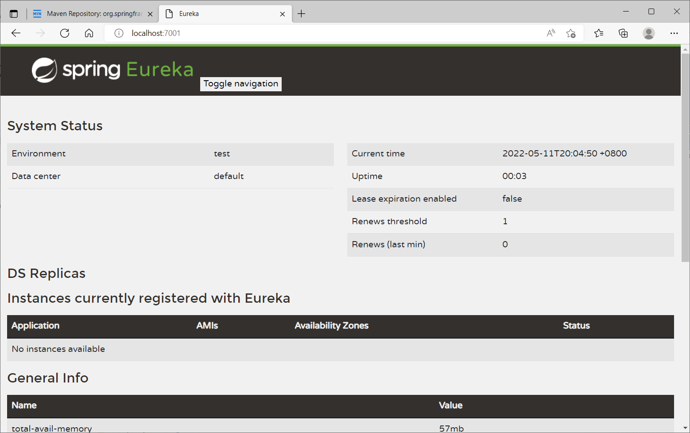


```java

@EnableEurekaServer // 配置eureka支持
@SpringBootApplication
public class EurekaApplication {
    public static void main(String[] args) {
        SpringApplication.run(EurekaApplication.class, args);
    }
}
```


- 自我保护机制： 如果某个服务在运行时候出现了问题， 那么Eureka不会立即丢弃这个服务， 而是会保存下这些信息，还会出现爆红的现象，  然后如果这个服务好了 ， 也还可以继续链接上来， 就会退出自我保护机制。 


### 注册服务者


- 然后就是配置client， 就是服务注册者：


- 首先导入依赖

```xml
<dependency>
    <groupId>org.springframework.cloud</groupId>
    <artifactId>spring-cloud-starter-eureka</artifactId>
    <version>1.4.7.RELEASE</version>
</dependency>
<dependency>
    <groupId>org.springframework.boot</groupId>
    <artifactId>spring-boot-starter-actuator</artifactId>
    <version>2.3.1.RELEASE</version>
</dependency>
```


​		**注意这里的版本需要低一点， 高了的话会注册不进去**

​		**可以直接用下面的新版， 船新版本。**

- 然后配yml文件

```yml
server:
  port: 8001

mybatis:
  type-aliases-package: com.ghj.springcloud.pojo
  config-location: classpath:mybatis/mybatis-config.xml
  mapper-locations: classpath:mybatis/mapper/*.xml


spring:
  application:
    name: spring-provider-dept #服务的名称
  datasource:
    type: com.alibaba.druid.pool.DruidDataSource
    driver-class-name: com.mysql.cj.jdbc.Driver
    url: jdbc:mysql://localhost:3306/db01?userUnicode=true&characterEncoding=utf-8&serverTimezone=UTC
    username: root
    password: 123456

#eureka的配置， 服务注册到什么地方
eureka:
  client:
    service-url:
      defaultZone: http://localhost:7001/eureka/
  instance:
    instance-id: springcloud-provider-dept-8001 #修改eureka上的默认信息描述

# 配置这个才会有info的信息
management:
  endpoints:
    web:
      exposure:
        include: "*"
  info:
    env:
      enabled: true

# info配置, 这里的配置随便玩。
info:
  app.name: ghj-springcloud
  company.name: alibaba
  school.name: ECUT
  ghj.name: lj


```

我们还可以给yml配置一下eureka.client.prefer-ip-address: true， 这样我们开启服务的时候， 鼠标悬浮在服务的连接上的时候， 就不是显示localhost:xxxx， 而是127.0.0.1:xxxx这种格式。


- 配置controller，写一个控制接口，client.getInstances 可以按照id来获取服务实例，然后可以获取到一些信息 ：

```java
@RestController
public class DeptController {

    @Autowired
    private DeptService deptService;

    @Autowired
    private DiscoveryClient client;

    @PostMapping("/dept/add")
    public String add(@RequestBody Dept dept){
        deptService.addDept(dept);
        return "ok";
    }

    @GetMapping("/dept/get/{id}")
    public Dept get(@PathVariable("id")Long id){
        return deptService.queryById(id);
    }

    @GetMapping("/dept/list")
    public List<Dept> getAll(){
        return deptService.queryAll();
    }

    @GetMapping("/dept/disc")
    public Object discovery(){
        List<String> services = client.getServices();
        List<ServiceInstance> instances = client.getInstances("SPRING-PROVIDER-DEPT");

        for (ServiceInstance instance : instances) {
            System.out.println(
                    instance.getHost() + "\t" +
                    instance.getPort() + "\t" +
                    instance.getUri() + "\t" +
                    instance.getInstanceId());
        }
        return this.client;
    }
}
```

 

- 然后 就是 配置启动类

```java
@EnableEurekaClient //配置eureka， 让注册中心发现， 扫描这个服务。
@SpringBootApplication
@EnableDiscoveryClient // 配置发现服务， 让注册中心发现， 扫描这个服务， 两个配置效果相同
public class DeptProvider_8001 {
    public static void main(String[] args) {
        SpringApplication.run(DeptProvider_8001.class,args);
    }
}
```


- 然后跑起来可以看到 服务的信息


**上面的两个依赖spring-cloud-starter-eureka-server， 以及spring-cloud-starter-eureka 都是老版本的， 官方都不维护 了， 以至于spring-boot-starter-actuator必须要降版本， 官方推荐还是用以下的两个依赖， 这样我们的actuator， 也不需要降版本了**

```xml
<!--服务注册中心的依赖-->
<dependency>
    <groupId>org.springframework.cloud</groupId>
    <artifactId>spring-cloud-starter-netflix-eureka-server</artifactId>
    <version>3.1.2</version>
</dependency>
<!--服务被注册的依赖-->
<dependency>
    <groupId>org.springframework.cloud</groupId>
    <artifactId>spring-cloud-starter-netflix-eureka-client</artifactId>
    <version>3.1.2</version>
</dependency>


```


### 集群


​		如果注册服务中心炸了， 那么就会有很严重的问题， 所有的服务都会拿不到， 因此， 我们需要有集群操作， 就是有多个注册服务中心， 这些注册中心都相互关联， 所有服务都要注册到这些注册中心中。这样一个崩了就还有别的 。 可以有很多个节点。


- 首先建两个模板端口号7002，7003， 文件配置都和7001一模一样， 只是端口号改掉， 然后主机号也需要不一样 ， 这是集群的关键， 因此我们需要去修改一下 系统文件C:\Windows\System32\drivers\etc\hosts， 下面改成：

  127.0.0.1       localhost7001
  127.0.0.1       localhost7002
  127.0.0.1       localhost7003

  然后就可以是要这些主机名， 但是其实都是127.0.0.1， 就是原来的localhost， 只是多了几个名字， 再然后就是需要关联这些服务注册中心了， yml文件：

- ```yml
  server:
    port: 7003
  
  eureka:
    instance:
      hostname: localhost7003
    client:
      register-with-eureka: false
      fetch-registry: false
      service-url:
        defaultZone: http://localhost7001:7001/eureka/,http://localhost7002:7002/eureka/
  ```

​	这里就是7003的配置， 其他两个也是一样。


-  再然后就是把服务注册到这些服务注册中心， 也只需要修改一下yml文件，就只需要修改这一段代码， 让服务都注册在这三个注册中心。 

```yml
#eureka的配置， 服务注册到什么地方
eureka:
  client:
    service-url:
      defaultZone: http://localhost:7001/eureka/,http://localhost:7002/eureka/,http://localhost:7003/eureka/
  instance:
    instance-id: springcloud-provider-dept-8001 #修改eureka上的默认信息描述
```


### eureka自我保护

eureka默认开启自我保护功能，也就是当某一个服务由于网络不通，eureka不能访问，那么eureka不会直接将该服务从注册表中剔除，而是会先等待一段时间，如果超过等待时间则会剔除服务。

eureka关闭自我保护机制：

​		服务注册中心配置：

```yaml
eureka:
  server:
    enable-self-preservation: false     # 表示关闭自我保护机制
    eviction-interval-timer-in-ms: 9000     # 表示设置服务最大的失联时间
```

​		对应服务配置：

```yaml
eureka:
    lease-renewal-interval-in-seconds: 1   # 发送心跳时间间隔
    lease-expiration-duration-in-seconds: 2    # 服务端接收心跳最大间隔时间
```


### CAP原则

- C 强一致性
- A 可用性
- P 分区容错性

CAP三进二原则: 要么满足CA， 要么AP， 要么CP， 不能三个都满足。

**ACID**

- 原子性
- 一致性
- 隔离性
- 持久性


分布式系统一般肯定是会保证容错性的， 那么要么就是AP， 要么CP，Zookeeper就是保证的CP而Eureka就是保证的AP。


#### Zookeeper保证的是CP

​		当向注册中心查询服务列表时， 我们可以容忍是几分钟之前的信息， 但是不可以容忍是服务直接down的不可用，就是服务注册功能对可用性的要求要高于一致性 ， 但是Zookeeper会出现这种情况， 如果说主节点因为网络或者什么原因， 与其他的节点失去了联系， 那么剩余的节点会选举出一个新的主节点， 这个选举的时间可能会花费很久， 而且这个时候整个服务是瘫痪状态， 不可访问， 这样就会然后、让用户很没有体验。


#### Eureka保证的是AP


​		Eureka优先保证可用性， 他的各个节点都是平等的， 一个节点挂掉并不会影响别的节点正常工作， 剩余的节点依然可以提供服务， Eureka客户端在向某个节点注册时， 如果连接失败 ，则会自动链接别的节点， 只要有一台服务机存在， 即可提供服务， 不过可能不是最新的信息， 除此之外， Eureka还有自我保护机制， 如果在15分钟之内超过85%的节点没有正常的心跳， 那么Eureka就会认为客户端与注册中心出现了网络故障， 会出现以下几种情况：

​	1、Eureka不再从注册表中移除因为长时间没有收到心跳而国企的服务。

​	2、Eureka仍然可以接受新的服务注册和查询请求， 但是不会被同步到其他的节点上（保证当前节点可用即可）

​	3、当网络稳定时， 当前实例新的注册信息会被同步到其他节点中


### RPC与HTTP

​		RPC (Remote Procedure Call)即远程过程调用，是分布式系统常见的一种通信方法，HTTP 调用其实也可以看成是一种特殊的 RPC，只不过传统意义上的  RPC 是指长连接数据交互，而 HTTP 一般是指即用即走的短链接

**HTTP VS RPC (普通话 VS 方言)**

​		HTTP 与 RPC 的关系就好比普通话与方言的关系。要进行跨企业服务调用时，往往都是通过 HTTP   API，也就是普通话，虽然效率不高，但是通用，没有太多沟通的学习成本。但是在企业内部还是 RPC  更加高效，同一个企业公用一套方言进行高效率的交流，要比通用的  HTTP   协议来交流更加节省资源。整个中国有非常多的方言，正如有很多的企业内部服务各有自己的一套交互协议一样。虽然国家一直在提倡使用普通话交流，但是这么多年过去了，你回一趟家乡探个亲什么的就会发现身边的人还是流行说方言。

​		如果再深入一点说，普通话本质上也是一种方言，只不过它是官方的方言，使用最为广泛的方言，相比而言其它方言都是小语种，小语种之中也会有几个使用比较广泛比较特色的方言占比也会比较大。这就好比开源  RPC 协议中 Protobuf 和 Thrift 一样，它们两应该是 RPC 协议中使用最为广泛的两个。


## Ribbon负载均衡器


**SpringCloud已经不用Ribbon了， 而是用的LoadBalancer， 来进行负载均衡。**


### 负载均衡

- 负载均衡就是把用户的请求平坦分到多个服务器上， 从而达到系统高可用，

- 常用软件 Nginx， Lvs等

- Dubbo、 SpringCloud都有自己的负载均衡， SpringCloud的负载均衡算法可以自定义。

- 负载均衡的分类：

  - 集中式：

    即在服务的消费方与提供方之间有独立的设施， 如Nginx， 该设施负责把请求通过某种手段转发到服务的提供方。

  - 进程式：

    将LB逻辑集成到消费方， 消费方从服务注册中心获取那些地址可用， 然后自己从这些地址选出一个最合适的。


### 消费者关联注册中心


- 我们首先还是需要到依赖， 就是之前的client依赖就够了，这里面存在LoadBalancer的依赖。 然后只需要在config文件里面， 我们之前向Spring注册了RestTemplate，在上面加一个负载均衡的注解就可以了：

```java
@Configuration
public class ConfigBean {

    /**
     * 实现负载均衡
     */

    @LoadBalanced
    @Bean
    public RestTemplate restTemplate(){
        return new RestTemplate();
    }
}

```


- 然后修改controller， 之前我们是通过直接访问服务提供者的service方法，现在我们去服务注册中心拿， 因为服务已经被注册进去了， 所以我们只需要改一下链接就好了， 把链接改成服务的名字， 客户端直接调用服务名就好了， 不用管地址与端口号。 

```java
@Autowired
    RestTemplate restTemplate;
    /**
     * Ribbon这里应该需要的是一个服务名， 因为如果写的是http://localhost:8001那么就只会直接访问服务端，
     * 都不会走注册中心， 这里需要写一个服务的名字， 这样就可以访问注册中心。
     */
    private static final String PREFIX = "http://SPRING-PROVIDER-DEPT";
```


### 实现负载均衡


- 我们创建三个服务， 名字都一样， 然后端口号不一样，访问的数据库也不一样， 这样消费者通过名字访问就可以实现访问三个里面的其中一个， 然后跑起来， 我们通过消费者去访问服务， 连续访问几次， 然后就会发现返回的数据是不一样的，是从三个数据库里面取出来一个， 这就实现了负载均衡 ， 消费者不是只访问一个服务提供者了， 而是访问组测中心里的全部。


​		**这里LoadBalance首先会去服务注册中心获取可用地址列表， 然后通过负载均衡算法， 获取最合适的一个地址， 再去访问， 这样就实现了负载均衡了。我们这里采用的市默认的负载均衡算法， 就是轮询， 每个服务器轮着来。 ** 


### 自定义负载均衡算法

通过ReactorServiceInstanceLoadBalancer这个接口， 我们可以看到有两个系统提供的实现类， 这两个就是 轮询算法， 和随机算法， 另一个是我们自己写的， 点进系统的两个算法， 会发现基本都一样， 就是构造不一样， 还有下面的算法计算不一样， 我们可以自己写一个随机算法， 就按照系统的抄一些， 然后很多东西我们可以省略。


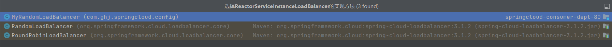


- 下面来看看我们自己写的负载均衡随机算法， 我们应该另外写一个包， 不被Spring默扫描的包， 也就是在application外的目录的包， 来存放这个类， 以及他的配置类， 因为如果放在了默认扫描的目录下， 那么Spring就会直接扫描到并注册到Spring里面， 会把原来负载均衡算法的覆盖掉，这样就算别的服务需要用， 也会使用我们自己定义的， 而默认的算法就没了。 ：

```java
public class MyRandomLoadBalancer implements ReactorServiceInstanceLoadBalancer {

    private ObjectProvider<ServiceInstanceListSupplier> serviceInstanceListSupplierProvider;

    public MyRandomLoadBalancer(ObjectProvider<ServiceInstanceListSupplier> serviceInstanceListSupplierProvider) {
        this.serviceInstanceListSupplierProvider = serviceInstanceListSupplierProvider;
    }

    @Override
    public Mono<Response<ServiceInstance>> choose(Request request) {
        ServiceInstanceListSupplier supplier = (ServiceInstanceListSupplier)this.serviceInstanceListSupplierProvider.getIfAvailable(NoopServiceInstanceListSupplier::new);
        return supplier.get(request).next().map((serviceInstances) -> {
            return this.processInstanceResponse(supplier, serviceInstances);
        });
    }

    private Response<ServiceInstance> processInstanceResponse(ServiceInstanceListSupplier supplier, List<ServiceInstance> serviceInstances) {
        Response<ServiceInstance> serviceInstanceResponse = this.getInstanceResponse(serviceInstances);
        if (supplier instanceof SelectedInstanceCallback && serviceInstanceResponse.hasServer()) {
            ((SelectedInstanceCallback)supplier).selectedServiceInstance(serviceInstanceResponse.getServer());
        }

        return serviceInstanceResponse;
    }
    private Response<ServiceInstance> getInstanceResponse(List<ServiceInstance> instances) {
        Random random = new Random();
        System.out.println("------------------------------"+instances.size());
        ServiceInstance instance = instances.get(random.nextInt(instances.size()));
        return new DefaultResponse(instance);
    }
}

```


​		**通过获得可用服务的列表， 然后放在一个List里面， 然后通过Random获取里面随机的一个返回，就可以实现随机获取了。 **


- 然后需要把这个算法注册到Spring里面， 就放在Configuration文件里面就行， 也是要在外面不被扫描的目录下。

```java
@Configuration
public class MyConfig {

    @Bean
    public ReactorServiceInstanceLoadBalancer myLoadBalancer(ObjectProvider<ServiceInstanceListSupplier> serviceInstanceListSupplierProvider){
        return new MyRandomLoadBalancer(serviceInstanceListSupplierProvider);
    }

}

```


​		**这里的参数不用管， Spring会自动注入进去， 我们就可以创建实例了。**


- 然后最后还要配置一下启动类：

```java
@SpringBootApplication
@EnableEurekaClient
@LoadBalancerClient(name = "SPRING-PROVIDER-DEPT", configuration = MyConfig.class)
public class ConsumerApplication {
    public static void main(String[] args) {
        SpringApplication.run(ConsumerApplication.class, args);
    }
}

```


​		**这里的@LoadBalancerClient(name = "SPRING-PROVIDER-DEPT", configuration = ConfigBean.class)就是配置负载均衡， name就是服务的名称， 就是8001~8003的名称，configuration 就是我们的配置类 的类型， 表示从里面去获取负载均衡算法。 **


- 然后直接启动， 访问数据库就会发现， 访问的是随机的数据库， 代表访问的服务是按照服务名字里面相同的随机的一个，这样就实现了负载均衡随机算法。 


- 修改负载均衡算法， 定义每个服务器访问五次就换下一个：

```java
private Response<ServiceInstance> getInstanceResponse(List<ServiceInstance> instances) {
        Random random = new Random();
        System.out.println("------------------------------"+instances.size());
        int index = (count/5)%3;
        count++;
        ServiceInstance instance = instances.get(index);
        return new DefaultResponse(instance);
    }
```


### Openfeign


​		我们之前从消费者访问服务者的service是通过RestTemplate来根据服务名称跳转请求的，而这种看起来会很不舒服，链接都是拼接来的，  java万物皆对象， 就把 这个服务名称放在一个接口对象里面， 这些生产者的请求也放在里面，把接口写在一个单独的模块， 然后消费者如果要调用服务，就引入对应的模块， 只需要拿到这个对象， 然后去用里面的方法调用服务， OpenFeign就是这样实现的。OpenFeign就是在Ribbon+ RestTemplate的基础上在封装了一层。


- 首先导入依赖：

```xml
<dependency>
    <groupId>org.springframework.cloud</groupId>
    <artifactId>spring-cloud-starter-openfeign</artifactId>
    <version>3.1.2</version>
</dependency>
```


- 在共模块上面 写一个service， 就是api模块， 这个service用来实现调用到服务端的请求。

```java
@Service
@FeignClient(name = "SPRING-PROVIDER-DEPT")
public interface FeignService {

    @PostMapping("/dept/add}")
    public String addDept(Dept dept);

    @GetMapping("/dept/get/{id}")
    public Dept queryById(@PathVariable("id") Long id);

    @GetMapping("/dept/list")
    public List<Dept> queryAll();

}

```


​		**这里的@FeignClient(name = "SPRING-PROVIDER-DEPT")就是根据名字去找到这个服务， 然后下面的代码实现调用这个服务的请求。 **


- 然后复制一个消费者， 名叫Feign， 配置和消费者的一样， 只需要改controller

```java
@RestController
public class MyController {

    @Autowired
    FeignService feignService;

    @RequestMapping("/consumer/dept/get/{id}")
    public Dept get(@PathVariable("id") Long id){
        return feignService.queryById(id);
    }

    @RequestMapping("/consumer/dept/add")
    public String add( Dept dept){
        return feignService.addDept(dept);
    }
    @RequestMapping("/consumer/dept/list")
    public List list(){
        return feignService.queryAll();
    }
}

```


​		**这里就是通过注入上面的FeignService， 来调用里面的方法， 从而调用服务提供者的请求**


- 启动类也需要加上注解@EnableFeignClients

```java
@SpringBootApplication
@EnableEurekaClient
@EnableFeignClients(basePackages = "com.ghj.springcloud")
public class FeignApplication {
    public static void main(String[] args) {
        SpringApplication.run(FeignApplication.class, args);
    }
}
```


​		**这个@EnableFeignClients(basePackages = "com.ghj.springcloud")， 就代表会Spring扫描到com.ghj.springcloud下的带有Feign的注解， 因为api模板是一个子模版， 所有的模板的pom依赖都有包含他， 所以， 我们这个Feign模板也是可以扫描到api模板的com.ghj.springcloud下的注解。**


## Hystrix断路器

​		

### 服务熔断


​		服务熔断，我们的微服务可能是一段连续请求各个服务器的， 如果其中有一个服务器崩了， 那么请求就会过不去， 那么就会一直卡在那边， 消费者就会一直占用这个请求， 越来越多之后就会让整个服务宕机， 这时候我们需要， 有一个备选的服务， 这样如果服务崩了， 就会有备选的服务， 从而返回给用户信息， 这时候就不会一直占用这个资源了， Hystrix就是来做这种的，为了保护服务器，这里都是在服务端做的措施。


下面我们就来实现：


- 首先建复制一个8001的服务， 然后导入以下依赖

```xml
<dependency>
    <groupId>org.springframework.cloud</groupId>
    <artifactId>spring-cloud-starter-netflix-hystrix</artifactId>
    <version>2.2.10.RELEASE</version>
</dependency>
```


- 其次修改controller，这里我们只保留一个根据id查询的服务

```java
@RestController
public class DeptController {

    @Autowired
    private DeptService deptService;


    @HystrixCommand(fallbackMethod = "hystrixGet")
    @GetMapping("/dept/get/{id}")
    public Dept get(@PathVariable("id")Long id){
        Dept dept = deptService.queryById(id);
        if(dept == null){
            throw new RuntimeException("id is null not found");
        }
        return dept;
    }

    private Dept hystrixGet(@PathVariable("id") Long id){
        return new Dept()
                .setDept_no(id)
                .setD_name("id=>" + id + "is not found")
                .setDb_source("no database in MySQL");
    }


}

```


​		**只要加上了@HystrixCommand(fallbackMethod = "hystrixGet")， 就代表如果该方法出现异常， 那么就会调用hystrixGet方法， 也就是我们下面定义的方法， 会返回一个 错误对象的信息， 而不是抛出异常， 出现错误。**


- 最后启动类加上注解：

```java
@EnableEurekaClient
@SpringBootApplication
@EnableHystrix
public class DeptProviderHystrix8001 {
    public static void main(String[] args) {
        SpringApplication.run(DeptProviderHystrix8001.class,args);
    }
}

```


​		**@EnableHystrix就代表该程序支持Hystrix。**


### 服务降级


​		服务降级， 当一个服务器访问过多时候， 服务器可能会绷不住， 这时候就需要更多的服务器， 有些服务器就很空闲， 我们可以直接把这个空闲的服务器停了， 去服务那些很火爆的服务， 这样就不至于服务器崩了， 但是会让这个空闲的服务器提供的服务关闭，但是如果用户访问这个服务， 我们并不希望直接报错， 而是有一些错误提示返回。 我们可以通过Feign来实现


- 首先要导入依赖， 在api客户端， 还有Fegin消费者都需要导入， 就是之前Hystrix的依赖。

```xml
<dependency>
    <groupId>org.springframework.cloud</groupId>
    <artifactId>spring-cloud-starter-netflix-hystrix</artifactId>
    <version>2.2.10.RELEASE</version>
</dependency>
```


- 然后在api模块的服务写一个服务暂停的备用服务， 需要实现FallbackFactory接口。

```java
@Service
public class FeignServiceDe implements FallbackFactory {
    @Override
    public FeignService create(Throwable cause) {
        return new FeignService() {
            @Override
            public String addDept(Dept dept) {
                return "null";
            }

            @Override
            public Dept queryById(Long id) {
                return new Dept()
                        .setDept_no(id)
                        .setD_name("该服务由于服务降级， 暂时暂停服务")
                        .setDb_source("无数据");
            }

            @Override
            public List<Dept> queryAll() {
                return new ArrayList<>();
            }
        };
    }
}

```


- 然后在常用的服务接口关联这个备用的服务， fallbackFactory = FeignServiceDe.class就是加了个这个注解， 出现服务降级就会直接访问这个接口：

```java
@Service
@FeignClient(name = "SPRING-PROVIDER-DEPT", fallbackFactory = FeignServiceDe.class)
public interface FeignService {

    @PostMapping("/dept/add}")
    public String addDept(Dept dept);

    @GetMapping("/dept/get/{id}")
    public Dept queryById(@PathVariable("id") Long id);

    @GetMapping("/dept/list")
    public List<Dept> queryAll();

}

```


- 最后需要在Feign消费者这里加一个配置 ， 开启服务降级

```yml
feign:
  circuitbreaker:
    enabled: true

```


### Dashboard 流监控


​		配置一个Hystrix的监控


- 首先建一个消费者的模块，导入对应的依赖， 还有新的依赖：

```xml
<dependency>
    <groupId>org.springframework.cloud</groupId>
    <artifactId>spring-cloud-starter-netflix-hystrix-dashboard</artifactId>
    <version>2.2.10.RELEASE</version>
</dependency>
<dependency>
    <groupId>org.springframework.cloud</groupId>
    <artifactId>spring-cloud-starter-netflix-hystrix</artifactId>
    <version>2.2.10.RELEASE</version>
</dependency>
```


- 然后编写yml文件， 修改端口为 9001

- 然后创建启动类， 加上注解开启流监控功能

```java
@SpringBootApplication
/**
 * 开启dashboard
 */
@EnableHystrixDashboard
public class DashboardApp {
    public static void main(String[] args) {
        SpringApplication.run(DashboardApp.class, args);
    }
}
```


- 然后就可以启动， 请求路径http://localhost:9001/hystrix， 然后就可以看到下面的页面：

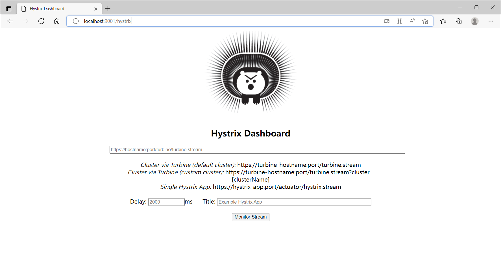


- 然后如果我们想要监控某个服务，需要有 @EnableHystrix注解的服务，那么就要去启动类里加一些东西， 这里的服务是之前的hystrix的服务，只需要加那个@Bean就好了， 这里的"/actuator/hystrix.stream" ， 就是上面的页面上的链接的后缀。

```java
@EnableEurekaClient
@SpringBootApplication
@EnableHystrix//对熔断的支持
public class DeptProviderHystrix8001 {
    public static void main(String[] args) {
        SpringApplication.run(DeptProviderHystrix8001.class,args);
    }
    @Bean
    public ServletRegistrationBean hystrixMetricsStreamServlet(){
        ServletRegistrationBean registrationBean = new ServletRegistrationBean(new HystrixMetricsStreamServlet());
        registrationBean.addUrlMappings("/actuator/hystrix.stream");
        return registrationBean;
    }
}

```


- 然后还需要配置dashboard的yml文件

```yml
hystrix:
  dashboard:
    proxy-stream-allow-list: "localhost"
```


- 然后启动一个注册中心， 启动hystrix的服务， 启动dashboard的消费者， 然后访问hystrix的http://localhost:8001/actuator/hystrix.stream， 如果一直在ping， 那么就先发一个get请求， 再请求这个， 然后在各个的dashboard的豪猪页面上输入请求路径， 毫秒数， 还有标题， 点击下面的监视就可以看到页面了

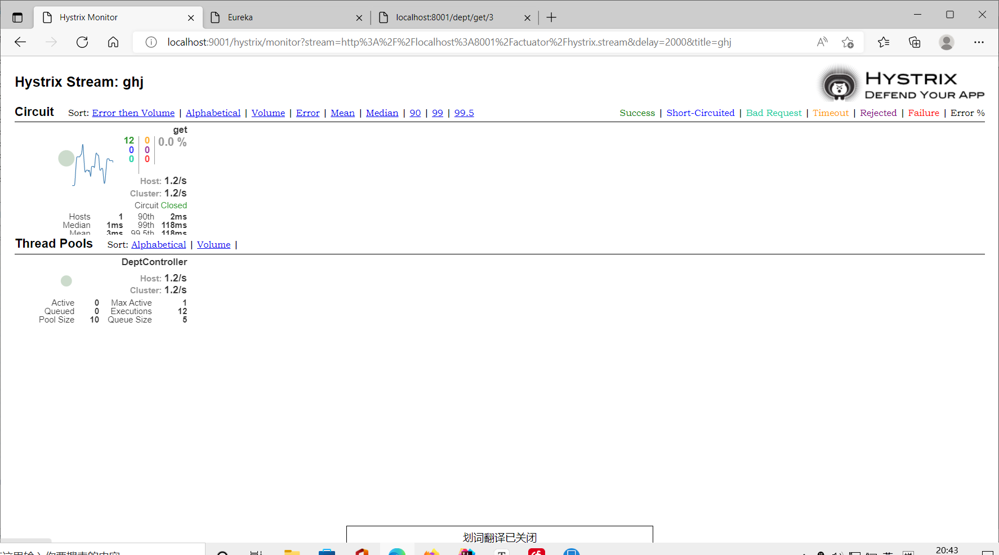


​		**这里的心跳图就是我们访问请求的频率， 频率越高圆点也越大， 还有请求出错率。**


## Gateway路由网关

 

**Spring Cloud Gateway 建立在 Spring Boot 2.x、Spring WebFlux 和 Project Reactor 之上。非阻塞异步模型， Zuul是阻塞式模型， 在高并发情况 ，Gateway具有更快的速度。**


**Route， Predicate， Filter**

- 首先我们来新建一个模块导入依赖， 记得不要导入spring-boot-starter-web，要么就要去配置yml 

```xml
<dependency>
    <groupId>org.springframework.cloud</groupId>
    <artifactId>spring-cloud-starter-gateway</artifactId>
    <version>3.1.2</version>
</dependency>
```


- 然后配置yml文件

```yml
server:
  port: 9527

spring:
  main:
    web-application-type: reactive #spring-boot-starter-web会与gateway依赖相互矛盾。
  application:
    name: cloud-gateway
  cloud:
    gateway:
      routes: # 可以配置多个， 这里只配置了一个， 再加的话就是 -id下面的再写一套
        - id: dept_8001 #路由ID，要唯一
          uri: http://localhost:8001 #匹配后提供服务的路径
          predicates:
            - Path=/dept/** #断言， 路径相匹配的进行路由

eureka:
  client:
    service-url:
      defaultZone: http://localhost7001:7001/eureka/,http://localhost7002:7002/eureka/,http://localhost7003:7003/eureka/
      fetch-registry: true # 要不要去注册中心获取其他服务的地址
      register-with-eureka: true

  instance:
    instance-id: gateway9527
    prefer-ip-address: true


```


- 然后配置启动类， 只需要加一个注册到Eureka服务就行

```java
@SpringBootApplication
@EnableEurekaClient
public class ZuulApplication {
    public static void main(String[] args) {
        SpringApplication.run(ZuulApplication.class, args);
    }
}
```


- 直接启动， 可以通过http://localhost:9527/dept/get/3访问到8001的服务。


- 第二种配置路由， 可以通过配置类来写， 但是有一点麻烦， 配置文件更简单。


### 负载均衡


我们知道负载均衡就是通过服务的名字来按照负载均衡算法获取对应的服务器， 所以我们需要改之前yml里的uri， 不能写死， 写成服务名就好了

```yml
spring:
  main:
    web-application-type: reactive #spring-boot-starter-web会与gateway依赖相互矛盾。
  application:
    name: cloud-gateway
  cloud:
    gateway:
      routes: # 可以配置多个， 这里只配置了一个， 再加的话就是 -id下面的再写一套
        - id: dept_8001 #路由ID，要唯一
          #uri: http:localhost:8001 匹配后提供服务的路径
          uri: lb://spring-provider-dept #匹配后提供服务的路由地址， lb就是LoadBalance的缩写， 就可以实现负载均衡了；
          predicates:
            - Path=/dept/** #断言， 路径相匹配的进行路由
      discovery:
        locator:
          enabled: true #开启从服务中心动态创建路由功能， 理由服务名进行路由


```


**注意这里的lb:就是用负载均衡的意思， 然后后面还需要开启从服务中心动态创建路由功能。**


### 断言


通过运行程序可以看到， 右侧有一堆After， Before， Header等一些配置， 这都是predicates里的配置， 就相当于是很多个判断语句， 需要都满足才可以进入访问， 如果不满足就会被拦截

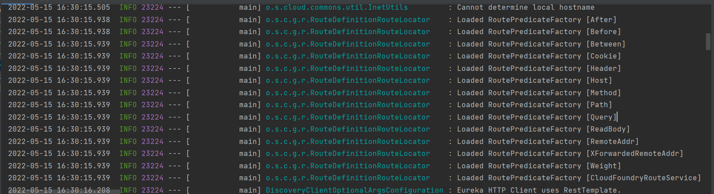


- 我们来设置一些玩意

```yml
predicates:
            - Path=/dept/** #断言， 路径相匹配的进行路由
            # - After=2022-06-15T17:23:06.302617600+08:00[Asia/Shanghai] #匹配改时间之后的， 进行路由
            - Cookie=username,ghj
            - Method=GET
```


- 可以看到设置了Cookie就需要Cookie带有username=ghj才可以访问

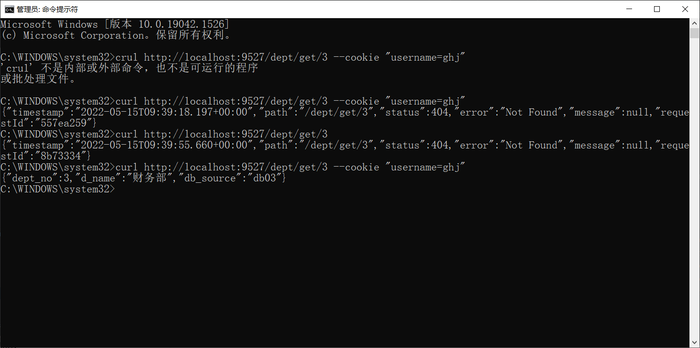


### 过滤

  官方给了三十多种玩法：


配一个：

```yml
routes: # 可以配置多个， 这里只配置了一个， 再加的话就是 -id下面的再写一套
        - id: dept_8001 #路由ID，要唯一
          #uri: http:localhost:8001 匹配后提供服务的路径
          uri: lb://spring-provider-dept #匹配后提供服务的路由地址， lb就是LoadBalance的缩写， 就可以实现负载均衡了；
          predicates:
            - Path=/dept/** #断言， 路径相匹配的进行路由
            # - After=2022-06-15T17:23:06.302617600+08:00[Asia/Shanghai] #匹配改时间之后的， 进行路由
            - Method=GET
          filters:
            - AddRequestHeader=X-Request-red, blue
```


​		**他将 X-Request-red:blue 标头添加到所有匹配请求的下游请求标头中**


### 全局过滤

- 自己写一个全局过滤器， 这种方式用的比较多， 官方的用的少， 我们可以给定规则， 只有name参数不为null才可以进入路由， 否则不行。


- 跟着官方文档来， 写一个组件， 注入spring， 这两个接口是官方说的， 不用管， 写就完了。

```java
@Component

public class CustomGlobalFilter implements GlobalFilter, Ordered {
    @Override
    public Mono<Void> filter(ServerWebExchange exchange, GatewayFilterChain chain) {
        MultiValueMap<String, String> queryParams = exchange.getRequest().getQueryParams();
        String name = queryParams.getFirst("name");
        if(name == null){
            exchange.getResponse().setStatusCode(HttpStatus.NOT_ACCEPTABLE);
            return exchange.getResponse().setComplete();
        }
        return chain.filter(exchange);
    }

    @Override
    public int getOrder() {
        return 0;
    }
}

```


​		**里面的方法就是获取request里的参数，然后判断是否为空， 空的话就被过滤了， 否则就可以进入下一个过滤器。**


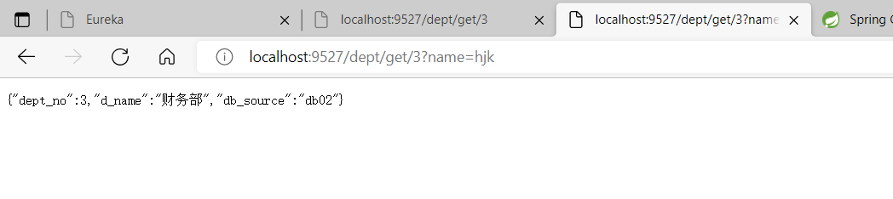


## config配置管理

​		我们在平时写程序时候， 可能需要修改一些配置文件， 如果是一个大型项目， 那就要成批修改，很麻烦， 我们可以把配置文件放在gitee上面， 然后改一个就好，项目里的就直接去读取里面的配置文件就好了。


#### 配置总控中心


- 搭建一个模块导入依赖

```xml
<dependency>
    <groupId>org.springframework.cloud</groupId>
    <artifactId>spring-cloud-config-server</artifactId>
</dependency>
```


- 然后是配置文件

```yml
server:
  port: 3344


spring:
  cloud:
    config:
      server:
        git:
          uri: https://gitee.com/guo-huanjun/cloud.git #访问的路径
          search-paths:
            - cloud #路径下的厂库
      label: main #分支， master就是main

```

这里要注意的就是不要写错路径， 


- 启动类只需要加一个注解**@EnableConfigServer**就好了

```java
@SpringBootApplication
@EnableConfigServer
public class Config3344 {
    public static void main(String[] args) {
        SpringApplication.run(Config3344.class, args);
    }
}

```


- 然后启动直接访问 http://localhost:3344/application-dev.yml ， 就可以看到我们的配置文件里的内容；
- 这里需要注意的是访问后面的路径要以以下形式访问， 我们一般用第三种， 就是/分支/文件名-版本.yml，使用第三中方式也可以访问其他分支的配置文件。

```txt
/{application}/{profile}[/{label}]
/{application}-{profile}.yml
/{label}/{application}-{profile}.yml
/{application}-{profile}.properties
/{label}/{application}-{profile}.properties
```


#### 客户端配置


- 我们搭建一个客户端， 从总控中心获取一些配置
- 首先导入依赖， 记得都要导入， 第一个是支持bootstarp.yml的依赖

```xml

<dependency>
    <groupId>org.springframework.cloud</groupId>
    <artifactId>spring-cloud-starter-bootstrap</artifactId>
</dependency>
<dependency>
    <groupId>org.springframework.cloud</groupId>
    <artifactId>spring-cloud-starter-config</artifactId>
</dependency>
```


​		**bootstarp.xml是系统配置， 比application.yml优先级更高。**

- 编写配置 ， 要注意这里的 拼接， 配置分支， 名字， 版本， 以及uri。

```yml
server:
  port: 3366

spring:
  cloud:
    config:
      label: main # 分支名
      name: application # 文件名
      profile: dev # 版本名
      uri: http://localhost:3344 # 访问的uri， 都拼接起来就是 http://localhost:3344/appliction-dev.yml
```


- 写一个controller， 这里可以直接从application里面拿到信息， 直接拿到config.info， 然后注入到info里面。

```java
@RestController
public class ConfigController {
    @Value("${config.info}")
    String info;
    @RequestMapping("/info")
    public String info(){
        return info;
    }
}

```


- 启动类不需要加别的注解， 直接启动， 可以直接访问数据。


​		**但是如果gitee上修改了数据， 虽然3344可以直接刷新获得新数据， 但是3366不可以， 只可以通过重启才可以获得新数据， 这样就非常的麻烦**

- 这个时候我们又可以来一点操作， 首先导入依赖， 图形化监控， 就是我们之前加过的。

```xml
<!--        图形化监控-->
<dependency>
    <groupId>org.springframework.boot</groupId>
    <artifactId>spring-boot-starter-actuator</artifactId>
    <version>2.6.7</version>
</dependency>
```


- 然后还要改yml文件， 暴露监控端点。

```yml
# 暴露监控端点
management:
  endpoints:
    web:
      exposure:
        include: "*"
```


- 最后在controller上加一个注解， 刷新的注解

```java
@RefreshScope
```


- 然后直接启动， 这样还是不可以直接刷新出最新的数据， 我们还要搞一点操作， 在cmd里面发一个post请求去当前的这个端口 curl -X POST "http://localhost:3366/actuator/refresh"，然后我们就可以直接在网页上刷新 ，可以获取最新的数据， 每次更新都是需要， 要不然就得重启。


## Bus消息总线


之前的config我们更改了配置， 需要所有的客户端都要提交一个POST请求才可以刷新数据， 这样显得很麻烦， 我们可以利用消息中间件， Rabbitmq， 配置中心刷新数据， 然后我们的3344是连着git的可以直接刷新， 数据跟新后，由我们的3344广播到所有关注了3344的客户端， 这样就可以实现只刷新一次就全部更新数据， 也可以通过跟新某个客户端来传染给其他的全部客户端， 这里我们使用前者方式。


### 配置

需要安装rabbitmq，需要添加依赖，以及配置文件修改

#### pom

```xml
        <dependency>
            <groupId>org.springframework.cloud</groupId>
            <artifactId>spring-cloud-starter-bus-amqp</artifactId>
        </dependency>
        <!--        图形化监控-->
        <dependency>
            <groupId>org.springframework.boot</groupId>
            <artifactId>spring-boot-starter-actuator</artifactId>
        </dependency>
```

3344服务端以及各个客户端都需要添加这两个依赖


#### 配置文件

```yml

# rabbitmq相关配置
  rabbitmq:
    host: 47.102.117.225
    port: 5672
    username: admin
    password: admin
    virtual-host: /

management:
  endpoints:
    web:
      exposure:
        include: "*"
```

也是服务端和客户端都需要添加此配置。


### 测试


#### 全部通知

接下来，启动服务端和客户端，修改git中的配置文件，然后只需要发送一个post请求：`localhost:3344/actuator/busrefresh`，全部的客户端获取到的配置都会更新，当然服务端不需要刷新也会。

#### 指定通知

与全部通知不同的是，post请求改为：`localhost:3344/actuator/busrefresh/服务名称:服务端口`，请求之后该客户端就会刷新配置，而别的客户端不会刷新。


## Stream


对于消息队列而言，每个项目可能会有多个不一样的消息队列，使用rabbitmq、kafka等，stream的引入则是为了降低开发者学习代价，使开发者使用一套统一的api而对不同的消息队列进行操作，不过目前stream仅仅支持rabbitmq、kafka这两个消息中间件。接下来将测试，stream对rabbitmq的api操作。


生产者与消费者都添加对应的pom依赖

```yml
        <dependency>
            <groupId>org.springframework.cloud</groupId>
            <artifactId>spring-cloud-starter-stream-rabbit</artifactId>
        </dependency>
```


### 生产者

配置文件

```yml
server:
  port: 8801
spring:
  application:
    name: cloud-stream-provider
  cloud:
    stream:
      binders:
        defaultRabbit:
          type: rabbit
          environment:
            spring:
              rabbitmq:
                host: ghjlj.cn
                port: 5672
                username: admin
                password: admin
      bindings:
        output:
          destination: SpringCloud-Stream
          content-type: application/json
          binder: {defaultRabbit
#eureka的配置， 服务注册到什么地方
eureka:
  client:
    service-url:
      defaultZone: http://localhost7001:7001/eureka/
  instance:
    instance-id: springcloud-stream-provider-8801 #修改eureka上的默认信息描述
    prefer-ip-address: true # 显示ip
    lease-renewal-interval-in-seconds: 1   # 发送心跳时间间隔
    lease-expiration-duration-in-seconds: 2    # 服务端接收心跳最大间隔时间
```


发送消息对应service接口

```java
/**
 * @author guohuanjun1
 * @date 2023/7/5
 */
public interface MessageProvider {
    /**
     * 发送消息
     * @return
     */
    String send();
}

```


接口实现类：

```java
import com.ghj.springcloud.service.MessageProvider;
import org.springframework.cloud.stream.annotation.EnableBinding;
import org.springframework.cloud.stream.messaging.Source;
import org.springframework.messaging.MessageChannel;
import org.springframework.messaging.support.MessageBuilder;

import javax.annotation.Resource;
import java.util.UUID;

/**
 * @author guohuanjun1
 * @date 2023/7/5
 */
@EnableBinding(Source.class)
public class MessageProviderImpl implements MessageProvider {

    @Resource
    MessageChannel output;

    @Override
    public String send() {
        String s = UUID.randomUUID().toString();
        output.send(MessageBuilder.withPayload(s).build());
        System.out.println("发出消息:" + s );
        return s;
    }
}
```


controller暴露rest接口，请求接口发送消息

```java
import com.ghj.springcloud.service.MessageProvider;
import org.springframework.web.bind.annotation.RequestMapping;
import org.springframework.web.bind.annotation.RestController;

import javax.annotation.Resource;

/**
 * @author guohuanjun1
 * @date 2023/7/5
 */
@RestController
@RequestMapping("/message")
public class MessageProviderController {

    @Resource
    MessageProvider messageProvider;

    @RequestMapping("/send")
    public String sendMessage(){
        return messageProvider.send();
    }
}
```


### 消费者


配置文件

```yml
server:
  port: 8802
spring:
  application:
    name: cloud-stream-provider
  cloud:
    stream:
      binders:
        defaultRabbit:
          type: rabbit
          environment:
            spring:
              rabbitmq:
                host: ghjlj.cn
                port: 5672
                username: admin
                password: admin
      bindings:
        input:
          destination: SpringCloud-Stream
          content-type: application/json
          binder: {defaultRabbit}
          group: ghjlj # 分组，避免消息被重复消费；此操作声明的队列不是临时队列，即使消费者宕机，重新连接后还是可以消费队列里的消息
#eureka的配置， 服务注册到什么地方
eureka:
  client:
    service-url:
      defaultZone: http://localhost7001:7001/eureka/
  instance:
    instance-id: springcloud-stream-consumer-8802 #修改eureka上的默认信息描述
    prefer-ip-address: true # 显示ip
    lease-renewal-interval-in-seconds: 1   # 发送心跳时间间隔
    lease-expiration-duration-in-seconds: 2    # 服务端接收心跳最大间隔时间
```


消费者对应接收消息service

```java
import org.springframework.beans.factory.annotation.Value;
import org.springframework.cloud.stream.annotation.EnableBinding;
import org.springframework.cloud.stream.annotation.StreamListener;
import org.springframework.cloud.stream.messaging.Sink;
import org.springframework.messaging.Message;

/**
 * @author guohuanjun1
 * @date 2023/7/5
 */
@EnableBinding(Sink.class)
public class MessageConsumerService {

    @Value("${server.port}")
    private Integer port;

    @StreamListener(Sink.INPUT)
    public void input(Message<String> message){
        System.out.println("端口:" + port + ",消费者收到消息" + message.getPayload() + "\t");
    }
}
```


### 测试结论


- 当消费者与生产者服务启动后，请求生产者接口发送消息，消费者服务便会收到消息。

- 当多个消费者存在时，会有消息重复消费情况，如需避免该现象需要配置group属性，使得消费者在同一个分组，对消息存在竞争关系。
- 当生产者发送消息时，消费者宕机，也可以通过group配置，因为配置group属性后将不是声明一个临时队列，生产者发送的消息会到交换机，然后再到队列，只要消费者服务恢复，队列里的消息依旧会被消费。


## Sleuth

sleuth+zipkin是用来监控请求的链路，也就是查看请求走了哪些服务：

- 首先需要下载zipkin的jar包并运行，下载地址https://repo1.maven.org/maven2/io/zipkin/zipkin-server/，运行后通过端口9411访问。

- 生产者和消费者都加上依赖：

  ```xml
          <dependency>
              <groupId>org.springframework.cloud</groupId>
              <artifactId>spring-cloud-starter-zipkin</artifactId>
              <version>2.2.8.RELEASE</version>
          </dependency>
  ```

  配置：

  ```yml
  spring:
    zipkin:
      base-url: http://localhost:9411
    sleuth:
      sampler:
        # 采样率，介于0-1，1表示全部采集
        probability: 1
  ```

- 之后只要消费者请求生产者就可以直接通过http://localhost:9411查看访问链路。


# SpringCloud Alibaba


springCloud Alibaba由阿里巴巴开发的框架。


## nacos


springcloud alibaba中的服务注册中心，不需要任何配置，直接下载运行就能启动，不需要配置服务注册中心，并且nacos还拥有配置中心的功能。


### 下载与安装

下载nacos-server：https://github.com/alibaba/nacos/releases/tag/2.0.4，安装后，找到bin目录用cmd打开，执行命令：`startup.cmd -m standalone`，之后通过http://localhost:8848/nacos访问首页，账号密码都是nacos。


### 服务注册

父依赖中需要添加依赖：

```xml
            <dependency>
                <groupId>com.alibaba.cloud</groupId>
                <artifactId>spring-cloud-alibaba-dependencies</artifactId>
                <version>2021.0.4.0</version>
                <type>pom</type>
                <scope>import</scope>
            </dependency>
```

当前服务添加依赖：

```xml
        <dependency>
            <groupId>com.alibaba.cloud</groupId>
            <artifactId>spring-cloud-starter-alibaba-nacos-discovery</artifactId>
        </dependency>
```


配置文件配置：

```yml
server:
  port: 9001
spring:
  application:
    name: nacos-payment-provider
  cloud:
    nacos:
      discovery:
        server-addr: localhost:8848

management:
  endpoints:
    web:
      exposure:
        include: '*'
```


启动类需要加上`@EnableDiscoveryClient`注解，启动之后可以在nacos界面查看到注册进去的服务。


### 负载均衡

复制一个服务提供者9002与9001配置一样，并且添加服务消费者83。


消费者需要添加负载均衡相关依赖：

```xml
        <dependency>
            <groupId>org.springframework.cloud</groupId>
            <artifactId>spring-cloud-starter-loadbalancer</artifactId>
        </dependency>
```


消费者配置基本与服务提供者一样：

```yml
server:
  port: 83
spring:
  application:
    name: nacos-order-consumer
  cloud:
    nacos:
      discovery:
        server-addr: localhost:8848

server-url:
  nacos-payment-server: http://nacos-payment-provider #可以不用，为了后面注入类的属性

management:
  endpoints:
    web:
      exposure:
        include: '*'
```


与之前的RestTemplate一样，需要自己配置

```java
import org.springframework.cloud.client.loadbalancer.LoadBalanced;
import org.springframework.context.annotation.Bean;
import org.springframework.context.annotation.Configuration;
import org.springframework.web.client.RestTemplate;

/**
 * @author guohuanjun1
 * @description: 配置类
 * @date 2023/7/9 18:21
 */
@Configuration
public class MyConfig {

    @Bean
    @LoadBalanced
    public RestTemplate getRestTemplate(){
        return new RestTemplate();
    }
}
```


配置完成之后加上controller

```java
import org.springframework.beans.factory.annotation.Value;
import org.springframework.web.bind.annotation.RequestMapping;
import org.springframework.web.bind.annotation.RestController;
import org.springframework.web.client.RestTemplate;

import javax.annotation.Resource;

/**
 * @author guohuanjun1
 * @description:
 * @date 2023/7/9 15:40
 */
@RestController
@RequestMapping("/consumer")
public class ConsumerController {

    @Value("${server-url.nacos-payment-server}")
    private String serverURL;

    @Resource
    RestTemplate restTemplate;

    @RequestMapping("/getPort")
    public String getPort(){
        return restTemplate.getForObject(serverURL + "/payment/getPort", String.class);
    }
}

```


**最后，当我们多次调用消费者接口，消费者就会轮询访问服务提供者的接口。**


### 配置中心

新建配置中心客户端模块，通过配置可以读取到nacos配置中心指定的配置文件，并且当配置中心修改配置发布后，客户端不用做任何操作，获取的配置文件内容也会改变。


pom内容：

```xml
        <!--nacos 服务发现注册-->
        <dependency>
            <groupId>com.alibaba.cloud</groupId>
            <artifactId>spring-cloud-starter-alibaba-nacos-discovery</artifactId>
        </dependency>

        <!--nacos 配置中心-->
        <dependency>
            <groupId>com.alibaba.cloud</groupId>
            <artifactId>spring-cloud-starter-alibaba-nacos-config</artifactId>
        </dependency>
```


bootstrap.yml

```yaml
server:
  port: 3377

spring:
  application:
    name: nacos-config-client
  cloud:
    nacos:
      discovery:
        server-addr: localhost:8848 # 指定nacos服务中心注册地址
      config:
        server-addr: localhost:8848 # 指定nacos作为配置中心地址
        file-extension: yaml # 指定yaml文件格式的配置

# 获取配置中心配置文件名默认就是 ${spring.application.name}-${spring.profile.active}.${spring.cloud.nacos.file-extension}，
# 这里就是  nacos-config-client-dev.yaml
```


application.yaml

```yaml
spring:
  profiles:
    active: dev
```


controller

```java
import org.springframework.beans.factory.annotation.Value;
import org.springframework.cloud.context.config.annotation.RefreshScope;
import org.springframework.web.bind.annotation.RequestMapping;
import org.springframework.web.bind.annotation.RestController;

/**
 * @author 86187
 */
@RestController
@RefreshScope
public class ConfigController {

    @Value("${server.port}")
    private Integer port;
    @Value("${config.info}")
    String info;
    @RequestMapping("/info")
    public String info(){
        return port + ":" + info;
    }
}
```


启动前需要在配置中心添加配置文件nacos-config-client-dev.yaml，并且配置`config.info`属性，启动后请求接口就可以获取到配置中心的配置，修改配置后发布，再次请求获取的配置也会修改。


### 配置文件的读取

之前的步骤仅仅是配置Data Id，也就是配置文件的名称。nacos不仅有Eureka配置中心功能，还具有分组功能，也就是说nacos可以配置多套配置文件，**服务查找配置文件是通过Namespace + Group + Data Id来获取**。也就是说可以通过配置Namespace和Group来个某个服务配置多套配置文件，**其中Namespace默认是public，Group默认为DEFAULT_GROUP**。


- 在nacos添加Namespace：dev、test；在对应的Namespace下添加配置文件，配置Group：DEV_GROUP、TEST_GROUP。

- 修改bootstrap.yml对应的配置，获取nacos不同的配置：

  ```yaml
  spring:
    application:
      name: nacos-config-client
    cloud:
      nacos:
        discovery:
          server-addr: localhost:8848 # 指定nacos服务中心注册地址
        config:
          server-addr: localhost:8848 # 指定nacos作为配置中心地址
          file-extension: yaml # 指定yaml文件格式的配置
          group: DEV_GROUP # 指定group
          namespace: 62b0abc5-8dac-49ed-b7b9-a9aa98dda4e2 # 指定namespace的id
  ```


之后便可以通过不同的配置获取不同的配置文件。


### 持久化配置

nacos自带一个小型数据库，默认情况下，我们的配置文件中的信息就是保存在这个数据库中。nacos支持配置mysql数据库，实现持久化配置。


根据官网描述，新建数据库nacos_config，在该数据库执行nacos安装目录下的conf文件夹下的nacos-mysql.sql脚本，然后编辑application.properties配置文件，添加如下参数：

```properties
spring.datasource.platform=mysql

db.num=1
db.url.0=jdbc:mysql://127.0.0.1:3306/nacos_config?characterEncoding=utf8&connectTimeout=1000&socketTimeout=3000&autoReconnect=true&useUnicode=true&useSSL=false&serverTimezone=UTC
db.user=root
db.password=123456
```


启动后就会发现之前的配置都没有了，添加配置也会保存进入mysql表中。


### nacos集群

本次学习在Linux上配置集群，并且使用nginx反向代理nacos集群，实现负载均衡。后期直接通过访问nginx，间接访问nacos集群。

- 需要配置cluster.conf集群配置文件，将集群中的所有nacos主机+端口号都配上。
- 配置nacos的持久化配置。
- 配置nginx负载均衡，代理nacos集群。
- 通访问nginx进而访问nacos集群。


## sentinel

作用类似于Hystrix。


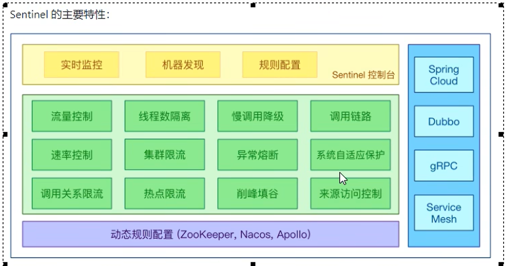

### 下载与安装

- 下载地址：https://github.com/alibaba/Sentinel/releases

- 下载完成之后直接`java -jar`启动。
- 通过8080端口访问，账号密码都是sentinel。


### 服务监控

新建工程8401，与之前nacos-server的pom不一样的是：

```xml
 <!--sentinel相关-->
        <dependency>
            <groupId>com.alibaba.csp</groupId>
            <artifactId>sentinel-datasource-nacos</artifactId>
        </dependency>
        <dependency>
            <groupId>com.alibaba.cloud</groupId>
            <artifactId>spring-cloud-starter-alibaba-sentinel</artifactId>
        </dependency>

```


配置文件：

```yaml
server:
  port: 8401
spring:
  application:
    name: cloudalibaba-sentinel-server
  cloud:
    nacos:
      discovery:
        server-addr: localhost:8848
    sentinel:
      transport:
        # 配置sentinel地址
        dashboard: localhost:8080
        # sentinel与当前服务交互的端口，  如果该端口被占用，会默认+1寻找新的端口。
        port: 8719

management:
  endpoints:
    web:
      exposure:
        include: '*'

```


新建一个测试的controller：

```java
import org.springframework.web.bind.annotation.RequestMapping;
import org.springframework.web.bind.annotation.RestController;

/**
 * @author guohuanjun1
 * @description: 测试接口
 * @date 2023/7/18 16:18
 */
@RestController
@RequestMapping("/test")
public class SentinelController {

    @RequestMapping("/a")
    public String testA(){
        return "=====test A";
    }

    @RequestMapping("/b")
    public String testB(){
        return "=====test B";
    }
}
```


首先启动nacos、sentinel，然后启动服务，因为sentinel使用的是懒加载，所以sentinel界面并不会直接显示8401服务，通过请求几次测试接口，然后刷新sentinel界面就可以看到8401服务。


### 流控

为了限制用户访问，从而保护服务。流控分为QPS流控与并发线程数流控。

#### 阈值类型

- QPS流控：限制单位时间内服务被允许的访问次数，如果超过该次数，那么会采取别的措施，可以返回错误等操作。
- 并发线程数流控： 限制某一个资源只能被指定线程数处理，如果请求太多，则会返回错误等操作。

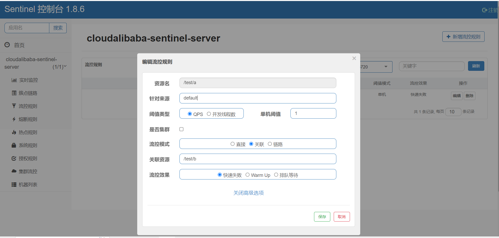


#### 流控模式

- 直接模式：以上的模式是直接模式，也就是说资源阈值达到后会直接执行流控效果。
- 关联模式：设置关联资源`/test/b`，当关联资源打到阈值，则会限制当前资源的访问。参考以上截图。也就是说当B接口访问QPS达到1，那么访问A接口则会被限制，直接访问失败。

#### 流控效果

- 快速失败：之前的配置都是快速失败，也就是打到阈值直接报错。
- Warm up（预热）：系统默认会有一个clodFactor（预热因子）默认等于3，系统在预热时长之前阈值都是单机阈值/clodFactor也就是3，系统经过预热时长5秒后，阈值变为10。当达到阈值时，系统也会报错。

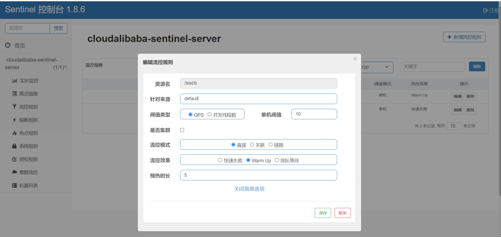

- 排队等待：设置单机阈值后，如果请求数超过阈值，那么剩下的请求将会进行排队等待，只有等待前面的处理完才会被处理。当等待时间超过超时时间时，则会直接报错。


### 熔断降级

当请求被处理的很慢，而又有很多个请求过来时，或者说服务处理请求出现异常比例很高，服务可能就会宕机，因此为了保护服务，需要有服务熔断的操作。


#### 熔断策略

Sentinel 提供以下几种熔断策略：

- 慢调用比例 (`SLOW_REQUEST_RATIO`)：选择以慢调用比例作为阈值，需要设置允许的慢调用 RT（即最大的响应时间），请求的响应时间大于该值则统计为慢调用。当单位统计时长（`statIntervalMs`）内请求数目大于设置的最小请求数目，并且慢调用的比例大于阈值，则接下来的熔断时长内请求会自动被熔断。经过熔断时长后熔断器会进入探测恢复状态（HALF-OPEN 状态），若接下来的一个请求响应时间小于设置的慢调用 RT 则结束熔断，若大于设置的慢调用 RT 则会再次被熔断。

  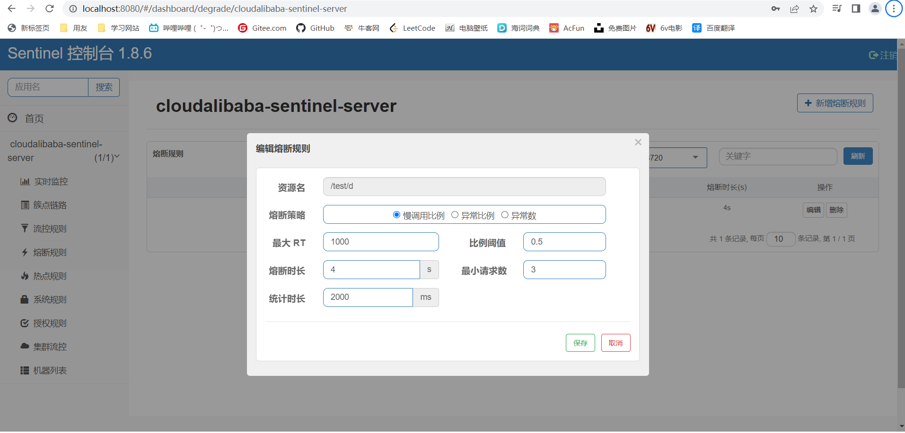

- 异常比例 (`ERROR_RATIO`)：当单位统计时长（`statIntervalMs`）内请求数目大于设置的最小请求数目，并且异常的比例大于阈值，则接下来的熔断时长内请求会自动被熔断。经过熔断时长后熔断器会进入探测恢复状态（HALF-OPEN 状态），若接下来的一个请求成功完成（没有错误）则结束熔断，否则会再次被熔断。异常比率的阈值范围是 `[0.0, 1.0]`，代表 0% - 100%。

  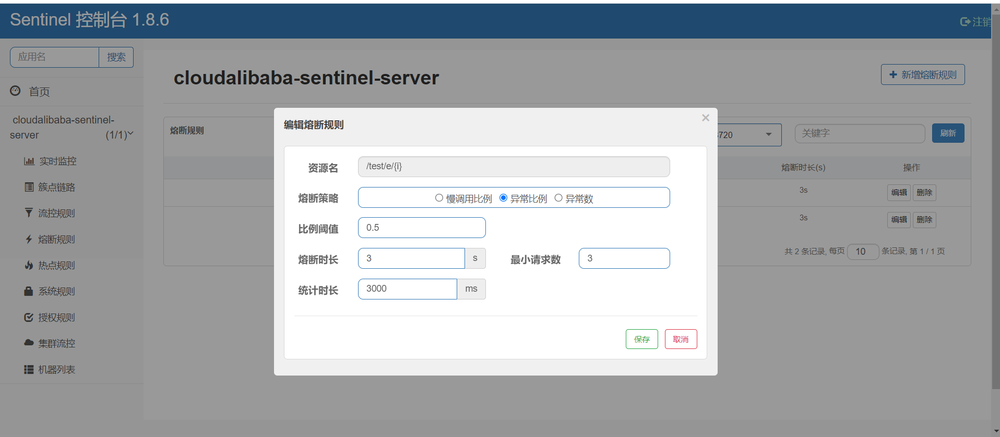

- 异常数 (`ERROR_COUNT`)：当单位统计时长内的异常数目超过阈值之后会自动进行熔断。经过熔断时长后熔断器会进入探测恢复状态（HALF-OPEN 状态），若接下来的一个请求成功完成（没有错误）则结束熔断，否则会再次被熔断。

  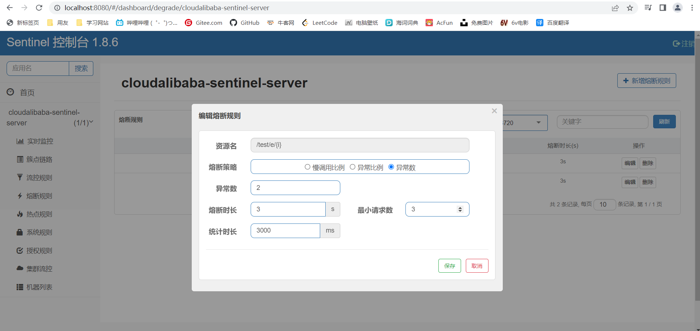


### 热点key

一般作用于get请求，查询功能。当请求某一个资源过多，请求中携带某一个参数是当前的热点参数时，需要对携带该参数的请求做限流，从而保护资源被访问过多。之前都是针对某一个资源来限流，现在可以通过携带参数来过滤，更加细致的限流。


#### 代码

新增一个controller接口;

```java
import com.alibaba.csp.sentinel.annotation.SentinelResource;
import com.alibaba.csp.sentinel.slots.block.BlockException;
import org.springframework.web.bind.annotation.*;

import java.time.LocalTime;
import java.util.concurrent.TimeUnit;

/**
 * @Description:
 * @author guohuanjun
 * @date 2023/7/19  11:50
 */
@RestController
@RequestMapping("/test")
public class SentinelController {

    @RequestMapping("/a")
    public String testA(){
        return "=====test A";
    }

    @RequestMapping("/b")
    public String testB(){
        System.out.println("当前线程:" + Thread.currentThread().getName() + "当前时间:" + LocalTime.now().getSecond() + "-----testB");
        return "=====test B";
    }

    @RequestMapping("/d")
    public String testD(){
        try {
            TimeUnit.SECONDS.sleep(1);
        } catch (InterruptedException e) {
            e.printStackTrace();
        }
        return "=====test D";
    }

    @RequestMapping("/e/{i}")
    public String testE( @PathVariable Integer i){
        int h = 10 / i;
        return "=====test E..." + h;
    }
    @GetMapping("/f")
    @SentinelResource(value = "testF", blockHandler = "dealHotKey")
    public String testF(@RequestParam(value = "a", required = false) Integer a,
                        @RequestParam(value = "b", required = false) Integer b){
        return "TestF......." + a + ":" + b;
    }

    public String dealHotKey(Integer a, Integer b, BlockException exception){
        return "dealHotKey......";
    }
}
```

主要是**`@SentinelResource`**注解，与hystrix中的**`@HystrixCommand`**基本类似。这个注解可以指定当前资源的名称，并且设置blockHandler属性，这个属性指定一个方法名，当该资源由于设置了限流而抛出BlockException，则会被指定的方法处理，而不是直接抛出异常界面。


#### 配置热点Key

在图形化界面中可以直接配置热点key的相关配置：

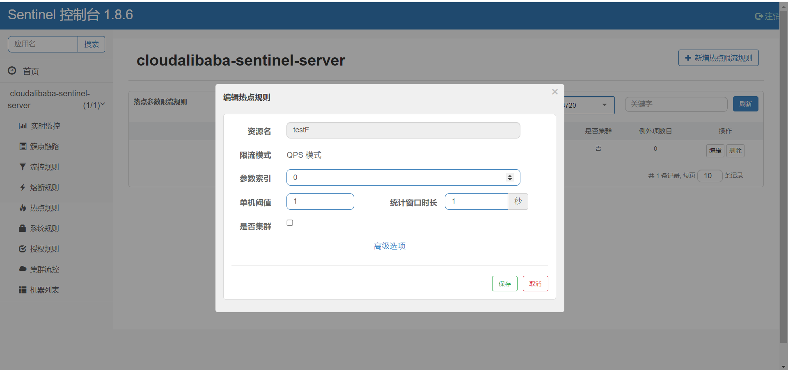

表示，如果资源`testF`请求时包含第0个参数的阈值达到了一秒一次，则会抛出BlockException异常。


#### 参数例外项

在图形化界面的热点key配置中，有一个高级选项，可以配置参数例外项。也就是说如果携带热点参数，但是参数的值是指定的某个值，那么可以对这种请求重新调整阈值。

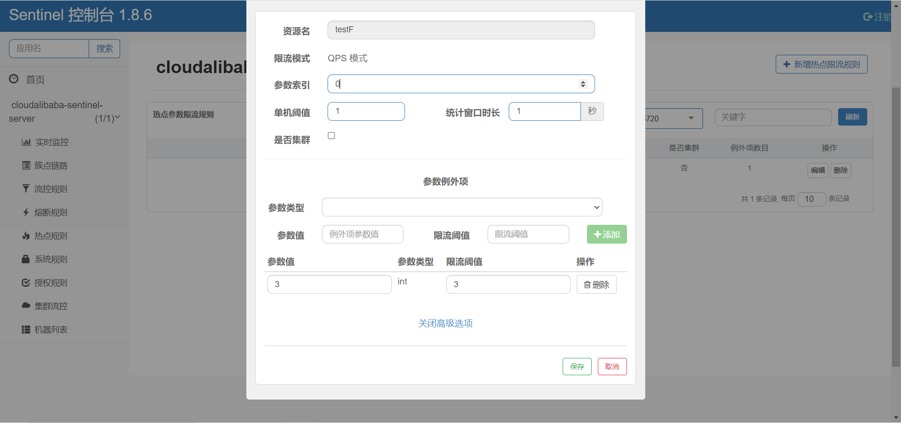


### 系统规则

sentinel还支持对整个系统的限流控制，对整个系统的所有资源进行控制，当系统资源访问量达到阈值，则会抛出异常。

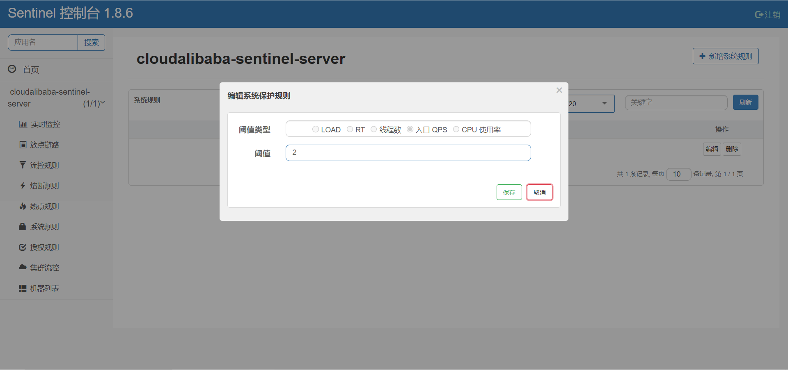


### 统一异常处理

在之前如果出现sentinel限流异常，那么将会走设置的`blockHandler`方法，如果每个方法都需要`blockHandler`方法，那么代码量将会剧增。于是乎，我们可以定义一个统一的异常处理，只需要注解配置指定为该方法就行。


公共返回：

```java
import lombok.AllArgsConstructor;
import lombok.Data;
import lombok.NoArgsConstructor;

import java.io.Serializable;
import java.util.List;

/**
 * @author guohuanjun1
 * @date 2023/7/22 16:10
 */
@Data
@NoArgsConstructor
@AllArgsConstructor
public class CommonResult<T> implements Serializable {
    /**
     * 返回编码
     */
    private Integer code;
    /**
     * 返回信息
     */
    private String message;
    /**
     * 返回数据
     */
    private T data;
    /**
     * 返回数组数据
     */
    private List<T> dataList;
}
```


sentinel全局异常处理：

```java
import com.alibaba.csp.sentinel.slots.block.BlockException;
import com.alibaba.csp.sentinel.slots.block.authority.AuthorityException;
import com.alibaba.csp.sentinel.slots.block.degrade.DegradeException;
import com.alibaba.csp.sentinel.slots.block.flow.FlowException;
import com.alibaba.csp.sentinel.slots.block.flow.param.ParamFlowException;
import com.ghj.springcloud.dto.CommonResult;

/**
 * sentinel 公共异常处理
 * @author guohuanjun1
 * @date 2023/7/22 16:08
 */
public class CommonSentinelExceptionHandler {
    public static CommonResult sentinelExceptionHandler( BlockException blockException){
        CommonResult result = new CommonResult<>();
        String msg = "";
        result.setCode(4444);
        // 依据不同的异常，判断是因为什么规则而限流的
        if (blockException instanceof FlowException) {
            msg = "请求被限流了";
        } else if (blockException instanceof ParamFlowException) {
            msg = "请求被热点参数限流";
        } else if (blockException instanceof DegradeException) {
            msg = "请求被降级了";
        } else if (blockException instanceof AuthorityException) {
            msg = "没有权限访问";
        }
        result.setMessage(msg);
        return result;
    }
}
```


测试controller：

```java
import com.alibaba.csp.sentinel.annotation.SentinelResource;
import com.ghj.springcloud.dto.CommonResult;
import com.ghj.springcloud.exception.CommonSentinelExceptionHandler;
import org.springframework.web.bind.annotation.RequestMapping;
import org.springframework.web.bind.annotation.RestController;

/**
 * @author guohuanjun1
 * @date 2023/7/22 16:30
 */
@RestController
@RequestMapping("/exception")
public class TestGlobalExceptionController {

    @RequestMapping("/a")
    @SentinelResource(value = "global", blockHandlerClass = CommonSentinelExceptionHandler.class, blockHandler = "sentinelExceptionHandler")
    public CommonResult<String> test01(){
        return new CommonResult<>(200, "success", null, null);
    }
}
```


当资源被限流时，就会走全局异常处理的方法。但是需要注意的是，异常处理的方法参数必须和资源的参数一致，还需要加上BlockException参数，并且返回值也需要和资源的返回值一致，这样才会被全局异常处理。


### @SentinelResource

​		前面讲过这个注解与hystrix中的**`@HystrixCommand`**基本类似。在`@sentinelResource`注解中，还有`fallback`和`fallbackClass`属性，用来配置资源抛出异常时的兜底方法。`exceptionsToIgnore`属性用来忽略异常，忽略的异常将不会被`blockHandler`和`fallback`抓取，不会被异常处理。


​		当资源抛出sentinel中的异常，也就是限流相关的异常时，如果有配置`blockHandler`属性，那么将会走`blockHandler`的异常处理方法，如果，没有配置，那么则会走`fallback`方法；如果资源抛出的异常不是`BlockException`类型，也就是说不是sentinel中的异常，那么会直接走`fallback`中的方法。


​		**简单来说，就是`blockHandler`仅仅只管sentinel中的异常，`fallback`处理所有的异常，但是`blockHandler`优先级高于`fallback`。**


### 结合Feign


#### 服务提供者


pom:

```xml
<dependencies>

        <!--        图形化监控-->
        <dependency>
            <groupId>org.springframework.boot</groupId>
            <artifactId>spring-boot-starter-actuator</artifactId>
        </dependency>

        <dependency>
            <groupId>org.springframework.cloud</groupId>
            <artifactId>spring-cloud-starter-bootstrap</artifactId>
        </dependency>
        <dependency>
            <groupId>org.springframework.boot</groupId>
            <artifactId>spring-boot-starter-web</artifactId>
        </dependency>
        <dependency>
            <groupId>org.springframework.boot</groupId>
            <artifactId>spring-boot-devtools</artifactId>
        </dependency>

        <dependency>
            <groupId>com.alibaba.cloud</groupId>
            <artifactId>spring-cloud-starter-alibaba-nacos-discovery</artifactId>
        </dependency>
        <!--sentinel相关-->
        <dependency>
            <groupId>com.alibaba.csp</groupId>
            <artifactId>sentinel-datasource-nacos</artifactId>
        </dependency>
        <dependency>
            <groupId>com.alibaba.cloud</groupId>
            <artifactId>spring-cloud-starter-alibaba-sentinel</artifactId>
        </dependency>

        <dependency>
            <groupId>org.example</groupId>
            <artifactId>springcloud-api</artifactId>
            <version>1.0-SNAPSHOT</version>
        </dependency>
        <dependency>
            <groupId>org.projectlombok</groupId>
            <artifactId>lombok</artifactId>
        </dependency>

    </dependencies>
```


配置文件：

```yaml
server:
  port: 9003
spring:
  application:
    name: nacos-payment-provider
  cloud:
    nacos:
      discovery:
        server-addr: localhost:8848
    sentinel:
      transport:
        # 配置sentinel地址
        dashboard: localhost:8080
        # sentinel与当前服务交互的端口，  如果该端口被占用，会默认+1寻找新的端口。
        port: 8719

management:
  endpoints:
    web:
      exposure:
        include: '*'
```


controller:

```java
/**
 * @author guohuanjun1
 * @description:
 * @date 2023/7/9 15:40
 */
@RestController
@RequestMapping("/payment")
public class PaymentController {

    @Resource
    private PaymentService paymentService;

    @RequestMapping("/getDept")
    public CommonResult<MyDept> getDept(@RequestParam(value = "id", required = false) Long id){
        CommonResult<MyDept> commonResult = new CommonResult<>();
        MyDept myDept = paymentService.getById(id);
        return commonResult.setCode(200).setMessage("success").setData(myDept);
    }
}

```


#### 公共模块


接口：

```java

/**
 * @author guohuanjun1
 * @date 2023/7/23 16:55
 */
@FeignClient(name = "nacos-payment-provider", fallback = SentinelServiceDe.class)
public interface SentinelService {
    /**
     * id查询
     * @param id
     * @return
     */
    @PostMapping("/payment/getDept")
    CommonResult<MyDept> getDept(@RequestParam(value = "id", required = false) Long id);
}
```


降级类：

```java
@Service
public class SentinelServiceDe implements SentinelService{
    @Override
    public CommonResult<MyDept> getDept(Long id) {
        return new CommonResult<MyDept>().setCode(999).setMessage("failed").setData(new MyDept(999L, "服务降级", "服务降级"));
    }
}
```


#### 服务消费者

pom:

```xml
<dependencies>

        <!--        图形化监控-->
        <dependency>
            <groupId>org.springframework.boot</groupId>
            <artifactId>spring-boot-starter-actuator</artifactId>
        </dependency>

        <dependency>
            <groupId>org.springframework.cloud</groupId>
            <artifactId>spring-cloud-starter-bootstrap</artifactId>
        </dependency>
        <dependency>
            <groupId>org.springframework.boot</groupId>
            <artifactId>spring-boot-starter-web</artifactId>
        </dependency>
        <dependency>
            <groupId>org.springframework.boot</groupId>
            <artifactId>spring-boot-devtools</artifactId>
        </dependency>

        <dependency>
            <groupId>com.alibaba.cloud</groupId>
            <artifactId>spring-cloud-starter-alibaba-nacos-discovery</artifactId>
        </dependency>
        <!--sentinel相关-->
        <dependency>
            <groupId>com.alibaba.csp</groupId>
            <artifactId>sentinel-datasource-nacos</artifactId>
        </dependency>
        <dependency>
            <groupId>com.alibaba.cloud</groupId>
            <artifactId>spring-cloud-starter-alibaba-sentinel</artifactId>
        </dependency>
        <dependency>
            <groupId>org.springframework.cloud</groupId>
            <artifactId>spring-cloud-starter-loadbalancer</artifactId>
        </dependency>
        <dependency>
            <groupId>org.springframework.cloud</groupId>
            <artifactId>spring-cloud-starter-openfeign</artifactId>
        </dependency>
        <dependency>
            <groupId>org.example</groupId>
            <artifactId>springcloud-api</artifactId>
            <version>1.0-SNAPSHOT</version>
        </dependency>

    </dependencies>
```


配置文件：

```yaml
server:
  port: 84
spring:
  application:
    name: nacos-order-consumer
  cloud:
    nacos:
      discovery:
        server-addr: localhost:8848
    sentinel:
      transport:
        # 配置sentinel地址
        dashboard: localhost:8080
        # sentinel与当前服务交互的端口，  如果该端口被占用，会默认+1寻找新的端口。
        port: 8719

server-url:
  nacos-payment-server: http://nacos-payment-provider


management:
  endpoints:
    web:
      exposure:
        include: '*'
feign:
  sentinel:
    enabled: true

```


controller:

```java
@RestController
@RequestMapping("/consumer")
public class ConsumerController {


    @Resource
    SentinelService sentinelService;

    @RequestMapping("/getDept")
    public CommonResult<MyDept> getPort(@RequestParam(value = "id", required = false) Long id){
        return sentinelService.getDept(id);
    }
}

```


#### 启动测试


启动之后访问消费者的接口，发现可以访问到提供者的接口；停止提供者服务，再次访问消费者，则会直接进入到公共模块的服务降级类。


### 持久化规则

之前配置的限流规则会在服务重启后消失，也就是说没有实现持久化配置。接下来可以使用nacos的配置文件进行sentinel的持久化配置。

pom:

```xml
        <dependency>
            <groupId>com.alibaba.csp</groupId>
            <artifactId>sentinel-datasource-nacos</artifactId>
        </dependency>
```


配置文件：

```yaml
server:
  port: 8401
spring:
  application:
    name: cloudalibaba-sentinel-server
  cloud:
    nacos:
      discovery:
        server-addr: localhost:8848
    sentinel:
      transport:
        # 配置sentinel地址
        dashboard: localhost:8080
        # sentinel与当前服务交互的端口，  如果该端口被占用，会默认+1寻找新的端口。
        port: 8719
      datasource:
        # 持久化相关配置
        ds1:
          nacos:
            server-addr: localhost:8848
            dataId: ${spring.application.name}
            groupId: DEFAULT_GROUP
            data-type: json
            rule-type: flow


management:
  endpoints:
    web:
      exposure:
        include: '*'

```


加上一个接口：

```java
    /**
     * 规则持久化
     * @return
     */
    @RequestMapping("/dataSource")
    @SentinelResource("dataSource")
    public String testDataSource(){
        return "sentinel 持久化规则";
    }
```


然后在nacos配置中心新建一个配置文件，Data Id为服务配置文件中指定的Data Id，文件类型为Json：

```json
[
    {
        "resource": "/test/dataSource",
        "limitApp": "default",
        "grade": 1,
        "count": 1,
        "strategy": 0,
        "controlBehavior": 0,
        "clusterMode": false
    }
]
```


配置解释：

```tex
resource: 资源名称;
limitApp:来源应用
grade: 闻值类型，0表示线程数，1表示QPS;
count: 单机闻值:
strategy: 流控模式，0表示直接，1表示关联，2表示链路:
controlBehavior: 流控效果，0表示快速失败，1表示Warm Up，2表示排队等待
clusterMode: 是否集群
```


配置完成之后，不管服务重启多少次，限流规则依旧在sentinel上，实现了规则持久化。
